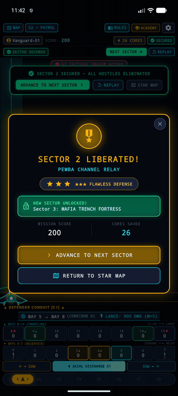

<!--
  Copyright 2026 Void Sower Authors.

  Licensed under the Apache License, Version 2.0 (the "License");
  you may not use this file except in compliance with the License.
  You may obtain a copy of the License at

      http://www.apache.org/licenses/LICENSE-2.0

  Unless required by applicable law or agreed to in writing, software
  distributed under the License is distributed on an "AS IS" BASIS,
  WITHOUT WARRANTIES OR CONDITIONS OF ANY KIND, either express or implied.
  See the License for the specific language governing permissions and
  limitations under the License.
-->

# Void Sower

**Void Sower** is an Afrofuturist tactical space defense game that synthesizes the ancient Swahili count-and-capture board game **Bao la Kiswahili** with orbital dreadnought fleet combat. Driven by a high-performance **C++17 EnTT Entity-Component-System (ECS)** backend and a **Flutter 3.x UI** connected via flat C-style Application Binary Interfaces (`extern "C"`) and Dart FFI pointers.

---

## 🎬 Official Gameplay & Tutorial Media

| 60-Second Narrated Tutorial Video | 30-Second AI Tactical Solver Showcase |
| :---: | :---: |
| [](docs/media/void_sower_how_to_play_60s.mp4) | [](docs/media/void_sower_solver_showcase_30s.mp4) |
| *[Watch 60s Narrated Tutorial (MP4)](docs/media/void_sower_how_to_play_60s.mp4)*<br>Neural voiceover (`ChristopherNeural`), HUD subtitles, ambient synth score | *[Watch 30s Solver Showcase (MP4)](docs/media/void_sower_solver_showcase_30s.mp4)*<br>Heuristic MCTS solver clearing 3 difficulty tiers with quadratic lances |

---

## 🎮 Redesigned Combat Mechanics & Visual Clarity

- **Player Flagship Identification & Conduit Aiming:** You command the **Olympus Dreadnought Flagship** (`▲ DREADNOUGHT CONDUIT ▲`) stationed at the bottom defense line. As you glide horizontally to evade bombs, your ship automatically docks with and arms that corridor's frontline battery, projecting a vertical cyan targeting laser with lock-on reticles over descending enemies.
- **Unified Tactical Action Deck:** Tap `DISCHARGE C[n] ►` to instantly unleash a quadratic Particle Lance, or `SOW CCW` to cycle energy into the inner reservoir. No complex multi-tap acrobatics needed while evading ordnance.
- **Dropping Invader Ordnance:** Void Swarm assault craft descend 8 tactical corridors and drop plasma bombs directly from their cannons. Maneuver to evade or vaporize them with particle lances (`DEFLECT +50`).
- **16-Bay Bao Mancala Sowing:**
  - **Frontline Batteries (Bays 8–15):** Directly aligned with tactical attack corridors C1–C8. Discharging a frontline terminal bay fires a massive **UPWARD Particle Lance** ($D = \alpha \cdot M^2$) that obliterates alien formations and deflects incoming bombs.
  - **Inner Reservoir (Bays 0–7):** Energy storage bank. Accumulate mass ($M \ge 4$) to prime devastating multi-lap cascade relays that loop across the ring.
  - **Hop-by-Hop Visual Cadence:** Sowing traversal visibly animates energy seeds hopping pit-to-pit at 65ms per bay with harmonic audio pitches before terminal discharge.

---

## 🛠️ Core Technology Stack

- **Frontend UI Layer:** Flutter 3.x / Dart FFI Engine (Android mobile first, portrait orientation & responsive tablet pillarbox).
- **Abseil Verbose Debug Logging:** Full runtime VLOG support integrated across Flutter and native C++ via `absl::SetGlobalVLogLevel(level)` and `--dart-define=VLOG_LEVEL=6`.
- **Core Game Engine Backend:** Modern C++ (C++17) with EnTT Entity Component System (ECS v3.13.2).
  - Power-of-two bitwise ring buffer masking (`& 0x0F`) with zero per-frame dynamic allocations on simulation hot paths.
  - Spatial grid corridor partitioning ($O(1)$ corridor lookup, capacity bounded to 32 entities per bucket).
  - Monte Carlo Tree Search (UCT) solver and backward-play program inversion wave generation.
  - Cache-line aligned structures (`alignas(64)`) to eliminate false sharing and match ARM L1 prefetch lines.
- **Build System Orchestrator:** Native CMake targeting Android 15 **16 KB memory page size alignment** (`-Wl,-z,max-page-size=16384`).
- **Visual Juice & Shaders:** Impeller GLSL 460 Fragment Shaders (`shaders/lance_beam.frag`, `shaders/flak_burst.frag`).
- **Audio & Haptics:** Procedurally pitch-scaled audio synthesis (`AudioService`) and multi-pulse haptic sequences (`HapticService`).

---

## 📋 Prerequisites

Before building or running the project, ensure you have the following installed:

1. **Flutter SDK** ($\ge 3.19.0$) with Dart SDK ($\ge 3.3.0$)
2. **CMake** ($\ge 3.22$)
3. **C++17 Compiler** (GCC / Clang / MSVC)
4. **Android NDK** (version `25.x` or later, required for Android native C++ cross-compilation)
5. **Android Studio & Emulator** (Pixel 10 Pro XL or Pixel Tablet with GPU acceleration)

---

## 🧪 Local Building & Testing (Without Running the App)

You can build and execute all native C++ tests, Flutter unit/widget tests, static analysis, and code format verifications strictly from the command line without launching the full mobile application.

### 1. Native C++ Engine Compilation & GTest Suite

Compile the native C++ engine shared library (`libvoid_sower.so`) and run the C++ Google Test suite:

```bash
# Configure CMake build directory
cmake -B build -S src

# Build native shared library and GTest binary
cmake --build build

# Execute native C++ unit and integration tests
./build/void_sower_tests
```

### 2. Code Formatting & Style Verification

Verify that all C++ and Dart source files strictly comply with Google Style Guides:

```bash
# Run repository pre-commit verification script
python3 scripts/verify_format.py --all

# Or run formatters individually:
clang-format --style=Google -i src/*.cpp src/*.h src/*/*.cpp src/*/*.h
dart format lib/ test/
```

### 3. Flutter Static Analysis

Run the static analyzer to check for warnings or type errors across the Flutter codebase:

```bash
flutter analyze
```

### 4. Flutter Unit & Widget Test Suite

Run the full Flutter unit and widget test suite (covering domain models, services, onboarding tutorial, dialogs, command arc, and projection shelf):

```bash
flutter test
```

### 5. Running with Abseil VLOG Debug Mode & Direct Combat Solver

Launch the application with full Abseil verbose logging enabled across both Flutter and the native C++ engine, with optional direct combat testing flags:

```bash
# Run with Abseil VLOG verbose debug mode (modeled after oware-2048)
flutter run --dart-define=VLOG_LEVEL=6

# Or launch directly into combat with the AI Tactical Solver active:
flutter run --dart-define=VLOG_LEVEL=6 --dart-define=START_COMBAT=true --dart-define=AUTO_SOLVE=true
```

---

## 📚 Complete Developer Documentation

Comprehensive technical specifications, mathematical derivations, and architecture blueprints are located in [`docs/developer/`](docs/developer/README.md):

| Guide | Link | Focus Areas |
| :--- | :--- | :--- |
| **01: Game Rules & Mechanics** | [`docs/developer/01_game_rules_and_mechanics.md`](docs/developer/01_game_rules_and_mechanics.md) | Swahili Bao transposition, 16-bay ring buffer geometry, quadratic lances ($D = \alpha \cdot M^2$), secondary flak, Nyumba/Kichwa/Kimbi bay archetypes. |
| **02: Native C++17 ECS Engine** | [`docs/developer/02_cpp_ecs_engine_architecture.md`](docs/developer/02_cpp_ecs_engine_architecture.md) | EnTT ECS v3.13.2 architecture, 64-byte alignment, zero allocation hot paths, bitwise masking (`& 0x0F`), spatial grid partitioning. |
| **03: Dart FFI Bridge & Isolates** | [`docs/developer/03_dart_ffi_bridge_and_isolate_architecture.md`](docs/developer/03_dart_ffi_bridge_and_isolate_architecture.md) | Flat C ABI (`extern "C"`), zero-copy pointer caching, Android 15 16 KB page size alignment, background isolate offloading. |
| **04: Presentation & Shaders** | [`docs/developer/04_presentation_shaders_and_audio_visual_pipeline.md`](docs/developer/04_presentation_shaders_and_audio_visual_pipeline.md) | Impeller GLSL 460 shaders, `CombatPainter` 60/120 FPS canvas, Afrofuturist `VoidTheme`, procedural acoustics, multi-pulse haptics. |
| **05: Campaign & Economy** | [`docs/developer/05_campaign_economy_and_player_identity.md`](docs/developer/05_campaign_economy_and_player_identity.md) | Kilwa Nebula Basin progression, Fleet Hangar chassis classes (MK-I/II/III), GDPR-compliant telemetry privacy, `$0.99` Pro IAP. |
| **06: APIs & Testing Guide** | [`docs/developer/06_apis_integration_and_testing_guide.md`](docs/developer/06_apis_integration_and_testing_guide.md) | GTest native test matrix, Flutter widget test cases, pre-commit format verification, 16 KB page alignment auditing. |
| **07: Procedural Generation** | [`docs/developer/07_procedural_generation_and_solvability_guarantees.md`](docs/developer/07_procedural_generation_and_solvability_guarantees.md) | Backward-play program inversion, mathematical solvability proofs, Monte Carlo Tree Search (UCT) solver, encounter taxonomy. |

---

## 📱 Release & Store Deployment Runbooks

- **[Google Play Console Deployment Guide](docs/play_console_deployment_guide.md)**: CI/CD automation, AAB bundle generation, Pre-Launch report audit, IAP setup.
- **[Firebase & Google Services Setup Guide](docs/firebase_and_google_services_setup_guide.md)**: CLI provisioning, SHA fingerprint extraction, Crashlytics NDK symbol mapping.
- **[Closed Beta & Rollout Protocol](docs/closed_beta_and_rollout_plan.md)**: 7-day beta testing protocol and staged production rollout schedule.
- **[Store Listing Metadata](store_listing/google_play_metadata.md)**: Multilingual store descriptions (English, Swahili, Yoruba, French, Spanish).

---

## 📄 License

Licensed under the Apache License, Version 2.0. Attributed to **Void Sower Authors**.
See [`LICENSE`](LICENSE) for details.
