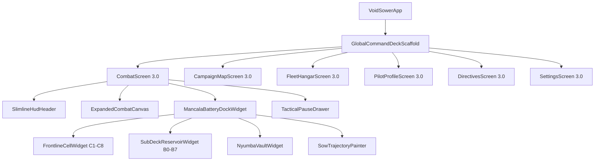

<!--
  Copyright 2026 Void Sower Authors.

  Licensed under the Apache License, Version 2.0 (the "License");
  you may not use this file except in compliance with the License.
  You may obtain a copy of the License at

      http://www.apache.org/licenses/LICENSE-2.0

  Unless required by applicable law or agreed to in writing, software
  distributed under the License is distributed on an "AS IS" BASIS,
  WITHOUT WARRANTIES OR CONDITIONS OF ANY KIND, either express or implied.
  See the License for the specific language governing permissions and
  limitations under the License.
-->

# 🌌 Void Sower 3.0 — Comprehensive UI/UX Redesign Specification

## 1. Executive Summary & Design Transformation

### 1.1 The Problem Diagnosis
Previous iterations of **Void Sower** suffered from two interrelated bottlenecks:
1. **Information Density & Visual Clutter**: The combat interface resembled an industrial audio mixer or an Excel spreadsheet. Two stacked rows of identical boxy buttons (16 capacitor bays), 8 corridor badges, projection shelves, and telemetry readouts occupied over 55% of the portrait mobile screen.
2. **Cognitive Overload & Friction in Meta-Navigation**: The campaign screen was overwhelmed by text banners, multi-tiered cards, and cluttered doctrine alerts. Navigating between combat, pause, settings, and star maps was prone to state desynchronization, frozen resumes, and disruptive jumping UI elements.

### 1.2 The UX 3.0 Paradigm: *"Tactile Afrofuturist Precision"*
Inspired by the newly synthesized vector design benchmarks (`gameplay.svg` and `sectors.svg`), **Void Sower 3.0** radically unifies the visual language, declutters the viewport, and anchors all primary interactive controls strictly within the ergonomic lower 30% thumb command arc:

```
┌─────────────────────────────────────────────────────────────────────────┐
│                          UX 3.0 DESIGN PILLARS                          │
├────────────────────────────┬─────────────────────────────┬──────────────┤
│ 1. EXPANDED COMBAT THEATER │ 2. ULTRA-COMPACT MANCALA DOCK│ 3. COHESIVE  │
│ ~560px of open space, 100% │ Total height 142px (vs 320px│ 5-tab global │
│ unobstructed lane clarity, │ before); frontline battery  │ command dock,│
│ dynamic in-world reticles, │ cells with integrated fire  │ glowing neon │
│ floating damage multipliers│ triggers & gold Nyumba vault│ glassmorphism│
└────────────────────────────┴─────────────────────────────┴──────────────┘
```

---

## 2. Design System Tokens & Aesthetic Foundations

### 2.1 Color Matrix & Luminescence Tokens

| Token Name | Hex Code | Opacity / Filter | Semantic Role |
|---|---|---|---|
| **Cosmic Obsidian** | `#05070f` | Solid 100% | Primary screen background, space void canvas |
| **Glass Surface Base** | `#0f172a` | 40% – 60% | Translucent card surfaces, HUD pills, secondary tiles |
| **Glass Border Slate** | `#1e293b` | Solid 1.0 – 1.2px | Crisp separation borders, unselected tab outlines |
| **Plasma Cyan (Hero)** | `#00f0ff` | Bloom `glow-cyan` (5px) | Primary interactive actions, active objectives, beam cores |
| **Electric Sky Blue** | `#38bdf8` | Solid / Glow (4px) | Eyebrow subtitles, shield gauges, lane guides |
| **Deep Marine Blue** | `#0284c7` | Solid / Gradient | Active tabs, completed progression nodes, pill badges |
| **Solar Gold (Prestige)** | `#fbbf24` | Bloom `glow-gold` (4px) | Reactor cores, campaign stars, critical hits, Nyumba count |
| **Amber Vault Flame** | `#f59e0b` / `#d97706` | Gradient / 1.5px border | Nyumba dual-chamber vault, Pro status highlights |
| **Crimson Flare (Danger)**| `#e11d48` / `#f43f5e` | Glow (4px) | Hostile vessels, atmospheric threshold, abort triggers |
| **Emerald Shield (Safe)** | `#10b981` | Glow (4px) | Deflected mines, high health telemetry, full boosts |
| **Text Primary** | `#ffffff` | 100% (Weight 800–900) | Numerical scores, vessel names, sector headers |
| **Text Secondary** | `#94a3b8` | 100% (Weight 600–700) | Secondary metadata, tier indicators, core unit tags |
| **Text Muted** | `#64748b` | 100% (Weight 600) | Inactive labels, locked requirements, timestamps |
| **Text Stealth** | `#334155` / `#475569` | 100% (Weight 700) | Empty cell pits (0 cores), locked spine guidelines |

### 2.2 Typography Hierarchy
All UI text utilizes the system sans-serif font family (`-apple-system, BlinkMacSystemFont, 'Segoe UI', Roboto, sans-serif`), rendering with crisp letter-spacing and strict semantic weight tiers:
- **Display Headlines (20px, Weight 900):** Screen titles (`KILWA NEBULA BASIN`, `ORBITAL DRYDOCK`, `COMMAND RECORD`).
- **Section Headers (14–17px, Weight 900):** Card titles (`Lindi Ridge Bastion`, `VANGUARD NX-1`, `SIMULATION PAUSED`).
- **Numerical Counters (12–16px, Weight 900):** Primary values (`SCORE: 034,820`, `36 CORES`, `★ 78 / 81`).
- **Action Labels (10–12px, Weight 900, Letter Spacing 0.5–1.0):** Buttons (`ENGAGE`, `RESUME COMBAT`, `EQUIPPED`, `SELECT`).
- **Eyebrow Tags (8.5px, Weight 800, Letter Spacing 1.5):** System context (`VOID SOWER // ORBITAL COMMAND`).
- **Tactical Subtext (8.5–10.5px, Weight 600):** Regional descriptors, doctrine qualifiers, threat tier notices.
- **Micro Pit Labels (6.5–7.5px, Weight 800–900):** Bay indicators (`C1`–`C8`, `B0`–`B7`, `NYUMBA`).

### 2.3 Glassmorphism & Elevation Geometry
- **Outer Shell:** Mobile portrait viewport `viewBox="0 0 400 860"`, `border-radius: 36px`, `box-shadow: 0 25px 60px rgba(0, 0, 0, 0.85)`.
- **Top Dynamic Notch:** `rect width="110" height="28" rx="14" fill="#000000"` with optical camera sensor dot.
- **Card Radius:** Standard cards `rx="14"`, Hero objective cards `rx="16"`, Interactive master docks `rx="18"`, Modals `rx="22"`.
- **Button Radius:** Full tactile pill styling (`rx="16"` to `rx="25"`).

---

## 3. Screen-by-Screen Redesign Specifications

### 3.1 Screen 1: Combat Viewport & The 142px Mancala Battery Dock
*(Refer to `docs/design/ux-3.0/gameplay.png` & `docs/design/ux-3.0/gameplay.svg`)*

```
┌────────────────────────────────────────────────────────────────────────┐
│ [S1 PATROL • ZANZIBAR REEF]   [⚡ 36 CORES]    [🛡️ 2/2]    [⏸ PAUSE]   │
├────────────────────────────────────────────────────────────────────────┤
│                                                                        │
│                                                                        │
│     [FOE IN LANE 2]                 [QUADRATIC ×16]                    │
│            ▼                        [CRIT IMPACT  ]                    │
│                                            ▲                           │
│                                            │ (PULSING LANCE)           │
│                                            │                           │
│                          [DEFLECT +50]     │                           │
│                          [MINE IN L6 ]     │                           │
│                                            │                           │
│                                            │                           │
│ - - - - - - - - - - - - - - - - - - - - - -│- - - - - - - - - - - - - -│
│                                         [SHIP @ C4]                    │
├────────────────────────────────────────────────────────────────────────┤
│ ORBITAL BATTERY CONDUITS (C1–C8)                  ‹ SWIPE PIT TO SOW › │
│ ┌───┐ ┌───┐ ┌───┐ ┌───┐ ┌───┐ ┌───┐ ┌───┐ ┌───┐                        │
│ │ 1 │ │ 5 │ │ 0 │ │ 6 │ │ 2 │ │ 4 │ │ 1 │ │ 2 │  (Frontline Cells)    │
│ │   │ │▓▓▓│ │   │ │FIRE│ │   │ │▓▓▓│ │   │ │   │                        │
│ │C1 │ │C2 │ │C3 │ │C4 │ │C5 │ │C6 │ │C7 │ │C8 │                        │
│ └───┘ └───┘ └───┘ └───┘ └───┘ └───┘ └───┘ └───┘                        │
│ ───┬───────────────────┬───────────────┬───────────────────┬────────── │
│   [1]     [2]     [0]  │ [ 7 ]   [ 6 ] │    [1]     [3]   [0]          │
│   B0      B1      B2   │   NYUMBA VAULT│    B5      B6    B7           │
└────────────────────────┴───────────────┴───────────────────────────────┘
```

#### Architectural Enhancements:
1. **Slimline Top HUD (Height: 38px, Y: 48):**
   - Translucent capsule housing Sector Name (`#38bdf8`) & Score (`#ffffff`).
   - Reactor Cores Capsule with gold glowing sphere, numerical balance (`36`), and unit label (`CORES`).
   - Shield Capsule showing active canopy count (`2/2`).
   - Quick Pause Capsule with dual minimal slate bars.
2. **Unobstructed Combat Theater (~560px Open Height):**
   - 8 subtle dashed lane tracks (`#38bdf8` at 0.12 opacity).
   - Active attack conduit column (C4) gently illuminated (`#00f0ff` at 0.04 opacity).
   - In-world floating feedback tags: `DEFLECT +50` (blue/gold pill) and `QUADRATIC ×16` (gold/slate badge).
   - Minimalist Interceptor Ship chassis positioned cleanly at the atmospheric boundary line ($Y = 635$).
3. **Ultra-Compact Battery Mancala Dock (Height: 142px, Y: 665 to 807):**
   - **Row 1 (Frontline Batteries C1–C8, Height: 52px):** 28×52px vertical pills. Displays real-time core count, segmented charge bars, shield canopy caps when primed (C2, C6), and an integrated **`FIRE`** tap trigger on the active/overloaded conduit (C4).
   - **Row 2 (Return Capacitors B0–B7 & Gold Nyumba Vault, Height: 30px):** Mini cells B0–B2 and B5–B7 (24×20px), flanking the central **Gold Nyumba Vault** (B3 & B4, 64×24px, `#291503` fill, `#f59e0b` border with gold bloom).
   - **Dynamic Sow Trajectory Arc:** Golden dashed arc directly indicating sowing flow from source pit to destination pit.
4. **Ergonomic Reminder:** `SWIPE BATTERIES TO SOW • TAP PRIMED CELL TO DISCHARGE` in subtle `#475569`.

---

### 3.2 Screen 2: Orbital Command & Campaign Progression Deck
*(Refer to `docs/design/ux-3.0/sectors.png` & `docs/design/ux-3.0/sectors.svg`)*

```
┌────────────────────────────────────────────────────────────────────────┐
│ VOID SOWER // ORBITAL COMMAND                           [🔵 LIBERATED] │
│ KILWA NEBULA BASIN                                      [    5/9     ] │
│ ══════════════════════════════════════════════════════════════════════ │
│ [ KILWA BASIN ]         [ PHANTOM DRIFT ]             [ VOID SWARM ]   │
├────────────────────────────────────────────────────────────────────────┤
│                                                                        │
│ (✓)─── [ Zanzibar Reef Gate                    ★★★  1,200 PTS ]       │
│  │     Outer Bastions • Tier 1                                         │
│  │                                                                     │
│ (✓)─── [ Pemba Channel Trench                  ★★★  1,650 PTS ]       │
│  │     Outer Bastions • Tier 1                                         │
│  │                                                                     │
│ (✓)─── [ Kaskazi Ion Straits                   ★★☆  3,400 PTS ]       │
│  │     Monsoon Straits • Tier 2                                        │
│  │                                                                     │
│ (◎)─── ┏━━━━━━━━━━━━━━━━━━━━━━━━━━━━━━━━━━━━━━━━━━━━━━━━━━━━━━┓        │
│  │     ┃ [ACTIVE SIEGE]                                       ┃        │
│  │     ┃ Lindi Ridge Bastion                 [ ◀  ENGAGE ]    ┃        │
│  │     ┃ Monsoon Straits • Tier 2 Corridors                   ┃        │
│  │     ┗━━━━━━━━━━━━━━━━━━━━━━━━━━━━━━━━━━━━━━━━━━━━━━━━━━━━━━┛        │
│  │                                                                     │
│ (🔒)─── [ Kilwa Kisiwani Citadel                       LOCKED ]        │
│  │     Core Siphon • Boss Dreadnought (Tier 3)                         │
│  │                                                                     │
│ ( )─── [ Songo Mnara Flagship                          LOCKED ]        │
│        Tier 3 Flagship Encounter                                       │
├────────────────────────────────────────────────────────────────────────┤
│   [🛡️]         [▲]           [👤]            [📖]           [⚙️]        │
│  SECTORS       FLEET         PILOT        DIRECTIVES      SETTINGS     │
└────────────────────────────────────────────────────────────────────────┘
```

#### Architectural Enhancements:
1. **Command Eyebrow & Integrated Header (<100px):**
   - Eliminates redundant multi-story banner boxes.
   - Title `KILWA NEBULA BASIN` paired with `LIBERATED 5/9` glowing pill on the top right.
   - High-contrast 4px neon progress track (`#1e293b` background with `#00f0ff` glow fill).
2. **32px Theater Switcher Tabs:**
   - Pill tabs (`KILWA BASIN`, `PHANTOM DRIFT`, `VOID SWARM`) cleanly switch campaign regions without page reloading or jarring layout shifts.
3. **Left-Spine Progression Trajectory:**
   - 2px continuous vertical spline line connecting all sector nodes.
   - **Completed Nodes:** 24px cyan circle (`#0284c7`) with crisp white checkmark icon.
   - **Active Objective Node:** 28px pulsing cyan circle with deep blue center (`#042747`) and glowing core.
   - **Locked Nodes:** 24px dark slate circle with quiet lock icon.
4. **Modular Sector Cards:**
   - **Completed Cards:** 56px height, dark slate `#0a101d`, sector name, stars (`★★★`), and best score.
   - **Hero Active Objective Card:** 76px height, glowing cyan border (`#00f0ff`), `ACTIVE SIEGE` badge, clear corridor intel, and prominent **`ENGAGE`** primary pill button.
   - **Locked Cards:** 56px height, subdued opacity (0.4–0.6), single-line clearance condition, unobtrusive `LOCKED` label.
5. **Universal 5-Tab Command Navigation Dock (84px Height, Y: 776):**
   - Persistent across all meta screens: `SECTORS`, `FLEET`, `PILOT`, `DIRECTIVES`, `SETTINGS`.
   - Active tab highlighted with an ambient circular cyan aura, cyan icon, and cyan label.

---

### 3.3 Screen 3: Orbital Fleet Drydock & Vessel Hangar
*(Refer to `docs/design/ux-3.0/fleet_hangar.png` & `docs/design/ux-3.0/fleet_hangar.svg`)*

#### Architectural Enhancements:
1. **Interactive Holographic Vessel Stage:**
   - Centered 330px hero card with circular projection rings and holographic cone.
   - Wireframe preview of the active dreadnought chassis (e.g. `VANGUARD NX-1`).
   - Plasma thruster and energy shield bloom effects.
2. **Tactical Stat Meters (Instant Visual Parsing):**
   - **Capacitor Array:** 16 Bays (8 Frontline + 8 Reservoir).
   - **Lance Coefficient:** $\alpha = 1.25$ (Pulse Multiplier).
   - **Nyumba Vault:** Dual-Chamber sub-deck battery.
   - **Status Action:** Large **`EQUIPPED`** cyan pill button.
3. **Chassis Catalog:**
   - `Bastion Siege-Dreadnought` (Unlocked, 24 Bays, Heavy Armor) with **`SELECT`** button.
   - `Phantom Drift Infiltrator` (Pro chassis, Instant Lateral Evasion) with glowing amber **`UNLOCK`** button.
   - `Swarm Crucible Flagship` (Locked until Sector 9 liberation).

---

### 3.4 Screen 4: Pilot Dossier, Accolades & Battle Records
*(Refer to `docs/design/ux-3.0/pilot_profile.png` & `docs/design/ux-3.0/pilot_profile.svg`)*

#### Architectural Enhancements:
1. **Hero Pilot Dossier Card (216px Height):**
   - Hexagonal holographic avatar frame with commander silhouette and golden service laurel.
   - Callsign: `CMDR. TARIQ NYERERE` with `PRO PILOT` badge and service count (`184 COMBAT DROPS`).
   - 3 Key Career Metrics:
     - **Campaign Stars:** `★ 78 / 81` (96% Liberated).
     - **Peak Score:** `148,920` (Top 1% Global).
     - **Lance Accuracy:** `94.8%` (S-Tier Aim).
2. **Honors & Citations Deck:**
   - `Mtaji Overload Master` (Gold badge, 500+ Quadratic Lances).
   - `Kilwa Basin Vanguard` (Completed, 3-Star mastery).
   - `Nyumba Vault Aegis` (200 / 250 bomb deflections progress bar).
   - `Incursion Wave 20 Vanguard` (Locked milestone).

---

### 3.5 Screen 5: Simulation Lab & AI Battle Solver
*(Refer to `docs/design/ux-3.0/simulation_lab.png` & `docs/design/ux-3.0/simulation_lab.svg`)*

#### Architectural Enhancements:
1. **Interactive Ring Buffer State Editor (Hero Card, 236px Height):**
   - Visualizes the 16-bay capacitor state in the exact layout of the combat dock.
   - Selecting a pit highlights the cell with a cyan halo and displays a stepper control (`-`, `+`, `CLR`) to easily set core counts.
2. **MCTS Tactical Recommendation Engine:**
   - Clear move recommendation: `RECOMMENDED SOW: C4 → CLOCKWISE (+6)`.
   - Tactical outcome prediction: *"Triggers Mtaji Overload on C8 • Lance Damage: 36 HP"*.
   - Readout badges: `WIN PROB: 98.4%`, `NET CORES: +4`, `LANCE: ×36 DMG`.
3. **Step Scrubber & Auto-Execution Controls:**
   - Step counter: `STEP 1 / 3 (Namua Priming Stage)`.
   - Tactile buttons: `‹ STEP` (previous) and **`PLAY STEP ›`** (next/auto-advance).

---

### 3.6 Screen 6: Tactical Pause Drawer & Quick Hardware Controls
*(Refer to `docs/design/ux-3.0/pause_and_modals.png` & `docs/design/ux-3.0/pause_and_modals.svg`)*

#### Architectural Enhancements:
1. **Frosted Glass Tactical Drawer (660px Height):**
   - Suspends simulation over a 65% dimmed combat theater, preserving visual combat context.
   - Top Telemetry Strip: Current Score (`034,820`), Reactor Cores (`36 / 50`), Canopy Shields (`2/2`).
2. **High-Contrast Ergonomic Action Buttons:**
   - **`RESUME COMBAT`**: Full glowing cyan pill with play icon. Instantly unpauses and resumes combat tickers smoothly.
   - **`RESTART SECTOR`**: Dark glass with sky blue outline.
   - **`SECTORS & CAMPAIGN MAP`**: Returns cleanly to star map without leaking navigation routes.
   - **`FLIGHT ACADEMY CODEX`**: Opens rules and strategy briefings.
   - **`SETTINGS & AUDIO`**: Accesses deep configuration.
   - **`ABORT TO ORBITAL COMMAND`**: Subdued crimson warning pill.
3. **Quick Hardware Toggles:**
   - 1-tap toggles for `SFX` [ON], `MUSIC` [ON], `HAPTIC` [ON], and `AI SOLVER` [OFF], eliminating the need to leave the game to adjust audio or vibration.

---

### 3.7 Screen 7: System Settings & Fleet Configuration
*(Refer to `docs/design/ux-3.0/settings.png` & `docs/design/ux-3.0/settings.svg`)*

#### Architectural Enhancements:
1. **Acoustic & Kinetic Calibration Hero Card:**
   - Continuous neon sliders for Combat SFX (85%) and Tactical Ambient Music (70%).
   - 4-segment tactile haptic selector: `OFF`, `SUBTLE`, `CRISP` (Active), `HEAVY`.
2. **Graphics & Visual Accessibility Deck:**
   - `120 FPS High Refresh Combat` toggle (smooth corridor tracking and laser bloom).
   - `Targeting Trajectory Reticles` toggle (high-visibility guides).
   - `Colorblind Assistance Mode` dropdown selector.
   - `Restore Pro Purchases & Cloud Sync` button.

---

## 4. Interaction & Ergonomic Standards

### 4.1 The Lower 30% Primary Thumb Arc
In accordance with **AGENTS.md Section 5.4**:
- All primary game inputs reside strictly within the bottom $260\text{ dp}$ of the viewport.
- Touch target sizes exceed $48 \times 48\text{ dp}$ for all interactive elements.
- The 8 frontline battery cells measure $28 \times 52\text{ dp}$ with minimum $4\text{ dp}$ gutters, supported by expanded hit-test areas ($36 \times 64\text{ dp}$).

### 4.2 Gesture Architecture
1. **Horizontal Swipe on Any Frontline/Reservoir Pit:**
   - Sows plasma cores clockwise (swipe right) or counter-clockwise (swipe left).
   - Trajectory guide arc illuminates in real-time beneath the thumb.
2. **Direct Tap on Overloaded/Primed Conduit:**
   - Conduit displays a prominent white **`FIRE`** badge when mass $M \ge 4$.
   - Tapping discharges the axial particle lance immediately into that corridor.
3. **Double-Tap Anywhere on Combat Screen:**
   - Emergency axial discharge from the highest-mass primed battery.
4. **Single Tap on Corridor Lane:**
   - Instantly maneuvers the dreadnought interceptor to align with that corridor.

---

## 5. Technical Implementation & Migration Roadmap

### 5.1 Presentation Layer Architecture Refactoring



### 5.2 Widget Replacement Mapping

| Legacy Widget (v2.0) | Redesigned Widget (v3.0) | Key Architectural Optimization |
|---|---|---|
| `CommandArcWidget` (2 stacked 8-bay grids + projection shelf) | `MancalaBatteryDockWidget` | Merged into single 142px dock; eliminates redundant projection shelf text. |
| `HudHeader` (3-row fragmented header) | `SlimlineHudHeader` | Single 38px row; 4 floating glass capsules. |
| `CombatPainter` | `ExpandedCombatCanvas` | ~560px open canvas, zero dynamic allocation, static paint pools. |
| `PauseMenuDialog` (dialog pop-up) | `TacticalPauseDrawer` | Full-screen translucent drawer with hardware toggles and instant resume. |
| `CampaignMapScreen` (monolithic card list) | `CampaignMapScreen 3.0` | Sleek left-spine trajectory, distinct active hero cards, unified bottom navigation. |

### 5.3 Zero-Allocation & Performance Compliance
- In accordance with **AGENTS.md Section 4 & 6**:
  - All canvas paints, shaders, and text painters in `ExpandedCombatCanvas` and `SowTrajectoryPainter` are pre-allocated statically once.
  - Bitwise masking (`& 0x0F`) is preserved across all 16-bay capacitor calculations.
  - No per-frame dynamic object allocation on the render hot path.

---

## 6. Visual Artifact Index

All full-fidelity vector mockups and rendered image assets are available in this directory:

- [**Combat Gameplay & Mancala Dock SVG**](file:///home/kelvingorekore/projects/void-sower/docs/design/ux-3.0/gameplay.svg)
- [**Combat Gameplay & Mancala Dock Rendered PNG**](file:///home/kelvingorekore/projects/void-sower/docs/design/ux-3.0/gameplay.png)
- [**Campaign Sectors & Trajectory Map SVG**](file:///home/kelvingorekore/projects/void-sower/docs/design/ux-3.0/sectors.svg)
- [**Campaign Sectors & Trajectory Map Rendered PNG**](file:///home/kelvingorekore/projects/void-sower/docs/design/ux-3.0/sectors.png)
- [**Fleet Drydock & Vessel Hangar SVG**](file:///home/kelvingorekore/projects/void-sower/docs/design/ux-3.0/fleet_hangar.svg)
- [**Fleet Drydock & Vessel Hangar Rendered PNG**](file:///home/kelvingorekore/projects/void-sower/docs/design/ux-3.0/fleet_hangar.png)
- [**Pilot Dossier & Accolades SVG**](file:///home/kelvingorekore/projects/void-sower/docs/design/ux-3.0/pilot_profile.svg)
- [**Pilot Dossier & Accolades Rendered PNG**](file:///home/kelvingorekore/projects/void-sower/docs/design/ux-3.0/pilot_profile.png)
- [**Simulation Lab & AI Solver SVG**](file:///home/kelvingorekore/projects/void-sower/docs/design/ux-3.0/simulation_lab.svg)
- [**Simulation Lab & AI Solver Rendered PNG**](file:///home/kelvingorekore/projects/void-sower/docs/design/ux-3.0/simulation_lab.png)
- [**Tactical Pause Drawer & Modals SVG**](file:///home/kelvingorekore/projects/void-sower/docs/design/ux-3.0/pause_and_modals.svg)
- [**Tactical Pause Drawer & Modals Rendered PNG**](file:///home/kelvingorekore/projects/void-sower/docs/design/ux-3.0/pause_and_modals.png)
- [**System Settings & Configuration SVG**](file:///home/kelvingorekore/projects/void-sower/docs/design/ux-3.0/settings.svg)
- [**System Settings & Configuration Rendered PNG**](file:///home/kelvingorekore/projects/void-sower/docs/design/ux-3.0/settings.png)
