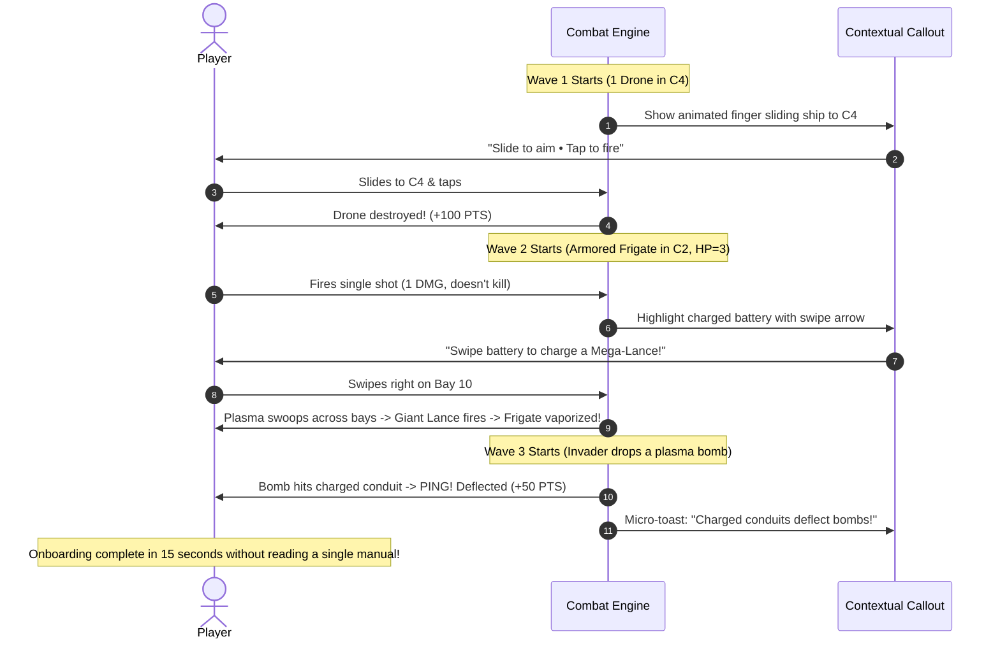

<!--
  Copyright 2026 Void Sower Authors.

  Licensed under the Apache License, Version 2.0 (the "License");
  you may not use this file except in compliance with the License.
  You may obtain a copy of the License at

      http://www.apache.org/licenses/LICENSE-2.0

  Unless required by applicable law or agreed to in writing, software
  distributed under the License is distributed on an "AS IS" BASIS,
  WITHOUT WARRANTIES OR CONDITIONS OF ANY KIND, either express or implied.
  See the License for the specific language governing permissions and
  limitations under the License.
-->

# 🚀 Void Sower 2.0 — UX & UI Redesign Specification

## 1. Executive Summary & Problem Diagnosis

Following closed-beta testing, user telemetry and direct player feedback highlighted a critical bottleneck:
> **The Core Problem**: While players praise the concept, aesthetic, and mechanical depth, the combat interface is overwhelming. The screen is too dense with technical readouts, and the onboarding relies on a 5-step textbook modal and a 60-second video. Players want to jump in and play immediately without feeling like they need to study an instruction manual or solve algebra.

### 1.1 Closed Testing Feedback Breakdown

| Feedback Category | Player Symptom | Root Cause in Current Architecture |
|---|---|---|
| **Visual Clutter** | *"The bottom half looks like an Excel spreadsheet or an audio mixer, not a space game."* | Two stacked rows of 8 identical boxes (16 bays) + 8 corridor tags (C1–C8) + 2 tier headers + projection shelf + discharge button cramming ~35 interactive elements in portrait mode. |
| **Information Density** | *"Too many numbers and icons flashing simultaneously; don't know where to look."* | Split-wing HUD shows callsign, tier, sector, pro status, score, high score, shield count, AI toggle, core count, energy progress bar, and 3 control buttons all at once. |
| **Onboarding Resistance** | *"I skipped the 5-step Flight Academy and video, but then I had no idea how to aim or why my ship stopped shooting."* | Onboarding is front-loaded in static modals (`TutorialOverlay` & `BaoCodexDialog`) explaining Swahili terms (*Namua*, *Kupanda*, *Mtaji*, *Safari*, *Takata*) and math ($D = \alpha \cdot M^2$) before letting the player touch the ship. |
| **Ambiguous Interaction** | *"Do I tap the corridor? Tap the bay? Double tap? Swipe? Press the big cyan button?"* | Redundant input channels: tapping C1–C8 badges, tapping bays, double tapping bays, upward flicking, swiping, and pressing the bottom axial discharge bar all compete for the same action. |
| **Disconnect Between Ship & Grid** | *"My eyes are glued to the bottom buttons rather than watching the enemies descend."* | The dreadnought ship in the combat corridor feels disconnected from the capacitor bay buttons at the bottom. |

---

## 2. Design Vision: "Void Sower 2.0"

### Core Design Philosophy: *"Show, Don't Tell; Play, Don't Study"*

1. **Direct Tactile Play Over Textbooks**: Eliminate pre-game instruction manuals and 60-second video requirements. Teach the core loop through three 4-second interactive micro-moments inside Sector 1.
2. **Unified Ship-Centric Deck**: Merge the 16 disjointed bay boxes into an intuitive, visual dreadnought battery array that directly aligns with the 8 attack corridors.
3. **In-World Holographic Telemetry**: Replace text-heavy telemetry shelves with glowing laser trajectories and beam charging animations directly on the combat canvas.
4. **Preserve Cultural Soul Through Prestige, Not Gatekeeping**: Retain the Afrofuturist identity, Bao count-and-capture rules, and East African starlore (Kilwa Basin, Zanzibar Reef, Pemba Channel, Kaskazi Ion Stream). Celebrate Swahili terms through thrilling arcade fanfare (*"MTAJI OVERLOAD!"*, *"KUPANDA CASCADE!"*) rather than upfront vocabulary tests.

---

## 3. Screen-by-Screen Redesign Architecture

### 3.1 Combat Viewport Layout Comparison

```
CURRENT (v1.0): Dense & Fragmented          REVOLUTIONIZED (v2.0): Clean & Integrated
┌──────────────────────────────────────┐     ┌──────────────────────────────────────┐
│ [CALLSIGN PRO S1]       [0/2 AI 36/50]│     │ [SCORE: 034,820]        [⚡ 28 CORES]│
│ SCORE 000,000       [⏸] [↺] [⏹]     │     │ S1 • Zanzibar Reef Gate          [⏸]│
├──────────────────────────────────────┤     ├──────────────────────────────────────┤
│                                      │     │                                      │
│           COMBAT VIEWPORT            │     │           COMBAT VIEWPORT            │
│       (8 Corridors, Hostiles)        │     │       (Holographic Grid Lines,       │
│                                      │     │        Dynamic Laser Reticles,       │
│              [SHIP]                  │     │        Hostile Attack Waves)         │
│   ▲ DEFENDER CONDUIT [C4] ▲          │     │                                      │
├──────────────────────────────────────┤     │              [SHIP]                  │
│ BAY 11 -> BAY 14 (C6) ACCUMULATE M=1 │     │     (Glows with current charge)      │
├──────────────────────────────────────┤     ├──────────────────────────────────────┤
│ ▲ BAYS 8-15 (FRONTLINE) C1-C8->LANCE │     │ 1 2 3 4 5 6 7 8  (Tactile Turrets)   │
│ [C1][C2][C3][C4][C5][C6][C7][C8]     │     │ [ ][ ][ ][⚡⚡⚡][ ][ ][ ][ ]          │
│ [8][9][10][11][12][13][14][15]       │     │ └── Sowing Arc Indicator ──┘         │
│ ▼ BAYS 0-7 (RESERVOIR) STORAGE->RELAY│     ├──────────────────────────────────────┤
│ [0][1][2][3][4][5][6][7]             │     │ [      ⚡ TAP TO FIRE LANCE      ]   │
├──────────────────────────────────────┤     │      (Swipe left/right to sow)       │
│ [⚡ AXIAL DISCHARGE C4 (INJECT BAY11)]│     └──────────────────────────────────────┘
└──────────────────────────────────────┘
```

---

## 4. Key Component Redesigns

### 4.1 HUD 2.0: Clean "Minimal Orbit" Header
- **Remove**: Callsign redundancy, Pro micro-badges during combat, redundant "PATROL / SIEGE" labels, secondary stop/restart buttons.
- **Top-Left**: Crisp, high-contrast **Score** with animated combo counter + current **Sector Name**.
- **Top-Right**: Integrated **Core Fuel Gauge**:
  - Displays remaining reactor cores cleanly as `⚡ 28` with an ergonomic warning glow when $\le 5$.
  - Single streamlined **Pause Button** that opens a full-screen tactical drawer containing Restart, Map, Settings, AI Solver toggle, and Sound controls.
- **Center Corridor**: 100% transparent spawn sightline ensuring incoming hostiles are instantly noticeable.

### 4.2 Tactical Canvas 2.0: Holographic Trajectory Overlays
- **Remove**: Text-based `ProjectionShelf` (`BAY 11 -> BAY 14 (CORRIDOR 6) ACCUMULATE: M=1 (MIN 4 FOR LANCE)`).
- **Add**: In-world holographic projection:
  - When dragging or hovering over a conduit, a subtle glowing cyan trajectory arc curves across the target bays.
  - A vertical reticle highlights the target attack lane.
  - Beam thickness visually communicates power level:
    - Mass 1–3: Slim focused laser pointer.
    - Mass 4–7: Heavy pulsing particle beam.
    - Mass 8+: Blinding orbital lance with screen distortion.
  - Players immediately *see* and *feel* the power of the lance without needing to calculate $D = \alpha \cdot M^2$.

### 4.3 Command Arc 2.0: Integrated Dreadnought Battery Deck
Instead of two competing rows of 8 identical boxes:
1. **Frontline Emitters (Corridors 1 to 8)**:
   - Form an organic, curved firing deck directly beneath the ship.
   - Each slot is labeled with its clear corridor number (1 through 8).
   - High-energy conduits display glowing plasma charges (e.g. 1 to 4+ pips).
2. **Inner Reservoir (Bays 0 to 7)**:
   - Treated as the ship's **Sub-Deck Reactor Core** rather than a second row of buttons.
   - Appears as a sleek glowing cyclical ring beneath the active emitters.
   - When energy cascades into the reservoir, an animation clearly shows plasma circulating under the deck and looping back to the frontline with a satisfying audio pulse.
3. **Streamlined Firing Trigger**:
   - A single, prominent tactile action bar: **`FIRE LANCE`**.
   - Direct gestures:
     - **Tap corridor**: Instantly moves the ship and aligns the target.
     - **Double-tap screen / Tap trigger**: Discharges the lance.
     - **Swipe left/right on any charged battery**: Sows plasma clockwise or counter-clockwise along the ring.

---

## 5. Zero-Manual Onboarding: The 3 Micro-Moments

Replace the 5-step modal textbook and 60-second video with seamless, context-sensitive micro-tutorials integrated into **Sector 1 (Zanzibar Reef Gate)**:



---

## 6. Cultural Lore & Afrofuturist Thematic Retention

Void Sower 2.0 preserves and amplifies its unique East African identity:
1. **Dynamic Combat Callouts**:
   - **Namua!** appears as floating golden runes when priming an empty bay.
   - **Kupanda Cascade!** flashes in cyan neon when a sowing loop initiates.
   - **Mtaji Overload!** detonates when an axial lance wipes out multiple hostiles in a corridor.
2. **The Starlord Codex**:
   - The ancient Swahili mathematical history and dreadnought engineering specs remain accessible in the **Tactical Codex**, accessible via the Pause menu or Hangar.
   - Players who love lore and mathematical strategy can dive as deep as they want, while action-first players are never blocked by it.
3. **Campaign & Sector Progression**:
   - Retain the rich planetary sectors: Kilwa Basin, Zanzibar Reef, Pemba Channel, Kaskazi Ion Stream, Kusi Vortex, Mafia Trench.

---

## 7. Implementation Roadmap & Milestones

| Milestone | Deliverables | Verification Strategy |
|---|---|---|
| **Phase 1: HUD 2.0** | Streamline `HudHeader` into minimal top bar; move secondary actions into Pause drawer. | Unit tests for HUD state + layout regression tests. |
| **Phase 2: Canvas Holographic Reticles** | Integrate targeting trajectories directly into `CombatPainter`; retire text-heavy `ProjectionShelf`. | Visual inspection on phone/tablet form factors. |
| **Phase 3: Command Arc 2.0** | Redesign `CommandArcWidget` with unified 8-corridor turret deck and cyclical sub-deck reservoir. | Touch interaction and gesture tests (`flutter test`). |
| **Phase 4: Micro-Tutorial Engine** | Replace `TutorialOverlay` with dynamic, non-blocking in-game micro-prompts for Sector 1. | Playtesting flow from cold-start to Sector 1 victory. |
