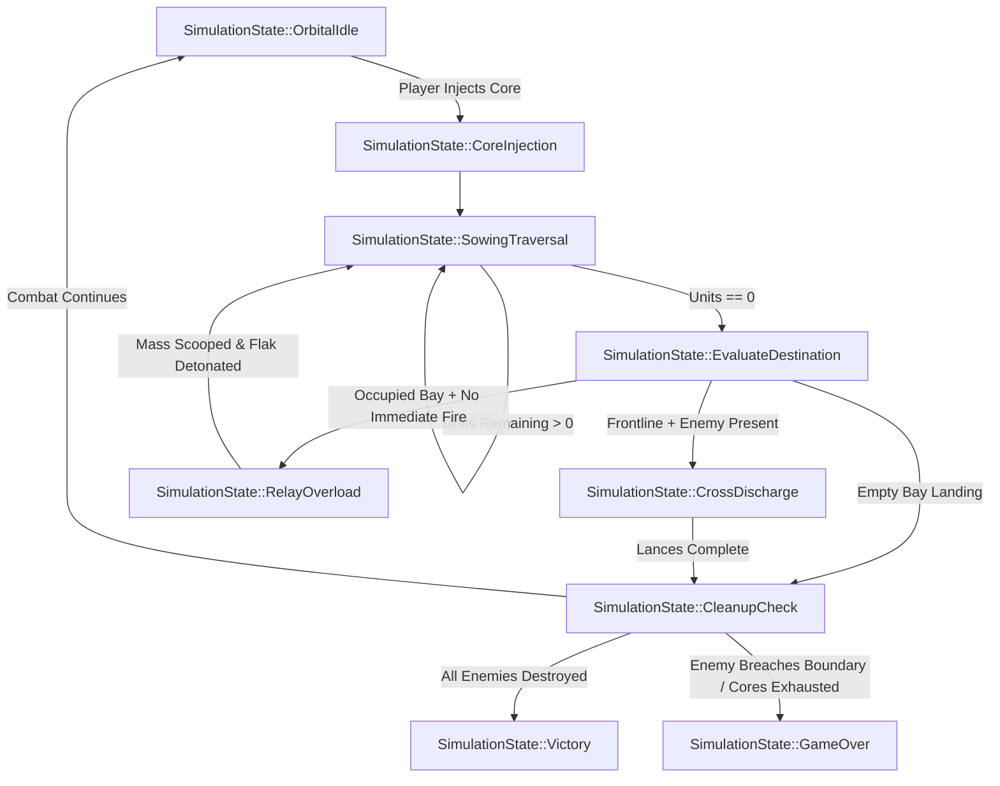

<!--
  Copyright 2026 Void Sower Authors.

  Licensed under the Apache License, Version 2.0 (the "License");
  you may not use this file except in compliance with the License.
  You may obtain a copy of the License at

      http://www.apache.org/licenses/LICENSE-2.0

  Unless required by applicable law or agreed to in writing, software
  distributed under the License is distributed on an "AS IS" BASIS,
  WITHOUT WARRANTIES OR CONDITIONS OF ANY KIND, either express or implied.
  See the License for the specific language governing permissions and
  limitations under the License.
-->

# Void Sower Developer Guide: Game Rules, Sowing Math & Quadratic Combat Mechanics

[◄ Developer Hub](README.md) | [01: Game Rules](01_game_rules_and_mechanics.md) | [02: ECS Engine](02_cpp_ecs_engine_architecture.md) | [03: FFI Bridge](03_dart_ffi_bridge_and_isolate_architecture.md) | [04: Presentation](04_presentation_shaders_and_audio_visual_pipeline.md) | [05: Campaign](05_campaign_economy_and_player_identity.md) | [06: Testing](06_apis_integration_and_testing_guide.md) | [07: Procedural Generation](07_procedural_generation_and_solvability_guarantees.md)

---

## 1. Executive Summary & Cultural Synthesis

**Void Sower** is an Afrofuturist tactical space defense game that translates the mathematical depth of the ancient Swahili count-and-capture board game **Bao la Kiswahili** into a 16-bay orbital dreadnought planetary defense grid.

Instead of traditional vertical shoot-'em-up mechanics where weapons fire continuously on fixed intervals, combat resolution in Void Sower is governed by deterministic **plasma core injection (*Namua*)**, **circular ring buffer distribution (*Kupanda*)**, and **axial cross-discharges (*Mtaji*)**. Plasma energy sowed into frontline batteries accumulates into high-energy clusters that discharge as **Quadratic Particle Lances ($D = \alpha \cdot M^2$)**, while multi-lap cascade overloads detonate **Secondary Radial Flak Bursts ($D_{\text{flak}} = \beta \cdot \sqrt{M'}$)**.

```
                  INVADING ENEMY ASSAULT WINGS
                       ▼       ▼       ▼
       ═══════════════════════════════════════════════════════ [Atmospheric Boundary: y=0.2]
       [C0]    [C1]    [C2]    [C3]    [C4]    [C5]    [C6]    [C7]  ◄── 8 Attack Corridors
        ║       ║       ║       ║       ║       ║       ║       ║
       [B8]    [B9]    [B10]   [B11]   [B12]   [B13]   [B14]   [B15] ◄── Outer Frontline Bays
       (Kichwa)(Kimbi)                                 (Kimbi) (Kichwa)
       ───────────────────────────────────────────────────────
       [B0]    [B1]    [B2]    [B3]    [B4]    [B5]    [B6]    [B7]  ◄── Inner Reservoir Bays
                               (Nyumba)(Nyumba)
                  ▲
                  └── Injected Plasma Core (Namua)
```

---

## 2. The 16-Bay Capacitor Ring Architecture

The dreadnought hull houses 16 discrete plasma capacitor chambers configured as a continuous circular ring buffer ($N = 16$). The ring is split into two distinct functional tiers:

### 2.1 Outer Frontline Batteries (Bays 8 to 15)
- **Corridor Alignment**: Each outer bay maps directly to one of the 8 vertical attack corridors on the planetary defense display:
  $$\text{Corridor } C = \text{Bay} - 8 \quad (C \in [0, 7])$$
- **Cross-Discharge Capability**: When a sowing sequence terminates in an occupied frontline bay that has enemy targets in its aligned corridor, the accumulated plasma mass discharges upward as an axial particle lance.
- **Vessel Interception**: Frontline bays provide the primary firepower required to crack armored hulls before enemy strike wings reach the atmospheric boundary.

### 2.2 Inner Reservoir Chambers (Bays 0 to 7)
- **High-Capacity Storage**: Inner bays store surplus plasma cores beneath the armor deck, shielded from direct enemy counterfire.
- **Cascade Amplification**: Sowing into inner bays does not discharge forward lances; instead, landing on an occupied inner bay scoops its charge and triggers a **Relay Overload**, continuing the sowing traversal around the hull with amplified momentum.
- **Strategic Trapping**: Players utilize inner bays to cycle energy into super-capacitors or position multi-turn traps.

---

## 3. Game Loop Cycle & Turn Resolution FSM

Combat execution in Void Sower runs through a deterministic 60 Hz Finite State Machine (FSM) defined in [`SimulationState`](file:///home/kelvingorekore/projects/void-sower/src/ecs/components.h#L69-L79):



### Turn Phases Detailed

1. **Phase 1: Orbital Idle (`OrbitalIdle`)**:
   - The dreadnought glides horizontally along the defense shelf ($x \in [0.0, 1.0]$) via smooth critically-damped spring interpolation.
   - The player selects an origin bay $b_0 \in [0, 15]$ and a traversal direction $\vec{d} \in \{+1 \text{ (Clockwise)}, -1 \text{ (Counter-Clockwise)}\}$.
   - The tactical HUD displays live trajectory predictions, terminal corridor targets, and anticipated quadratic lance damage.

2. **Phase 2: Core Injection (`CoreInjection` / *Namua*)**:
   - **The 28-Core Finite Economy**: The flagship reactor maintains a strict budget of **28 Reserve Cores** per sector.
   - **Zero-Bay Sowing (*Namua* Rule)**: Sowing from any bay (even with $0$ charge) draws $1$ core from reserves to plant into that bay before scooping and initiating the traversal. **Energy is never created from nothing.**
   - Floating arcade telemetry (`-1 CORE (NAMUA)`) drifts from the hull, and the HUD reactor gauge decrements from $28 \to 27$.
   - Once `reserve_cores == 0`, empty bays can no longer be sown—players may only redistribute existing energy already in the capacitor ring.
   - The entire accumulated plasma mass $M = \text{charge\_units}(b_0)$ is scooped into the distribution head:
     $$\text{remaining\_units} \leftarrow M, \quad \text{charge\_units}(b_0) \leftarrow 0$$
   - The dreadnought locks input controls (`is_cascading = 1`).

3. **Phase 3: Sowing Traversal (`SowingTraversal` / *Kupanda*)**:
   - For each step, the distribution head advances to the next bay using single-cycle bitwise masking:
     $$b_{k+1} = (b_k + \vec{d} + 16) \ \& \ 0\text{x}0\text{F}$$
   - Exactly $1$ unit of plasma is deposited into $b_{k+1}$:
     $$\text{charge\_units}(b_{k+1}) \leftarrow \text{charge\_units}(b_{k+1}) + 1$$
     $$\text{remaining\_units} \leftarrow \text{remaining\_units} - 1$$
   - If this is an active relay lap ($\text{cascade\_depth} > 0$), the distribution head emits an intermediate flak particle trail.

4. **Phase 4: Destination Evaluation (`EvaluateDestination`)**:
   - When $\text{remaining\_units} = 0$, the terminal bay $b_{\text{term}}$ is inspected:
     - **Case A: Frontline Cross-Discharge (*Mtaji*)**: If $b_{\text{term}} \in [8, 15]$ and enemies occupy corridor $C = b_{\text{term}} - 8$, transition to `CrossDischarge`.
     - **Case B: Relay Overload (*Safari*)**: If $b_{\text{term}}$ was already occupied ($\text{final\_mass} > 1$) and is not an active Nyumba sanctuary, transition to `RelayOverload`.
     - **Case C: Resting Drop (*Takata*)**: If $b_{\text{term}}$ was empty or Nyumba retention applies, sowing terminates cleanly without further relay. Transition to `CleanupCheck`.

5. **Phase 5: Cross-Discharge & Overload Resolution**:
   - In `CrossDischarge`, an axial particle lance is fired up corridor $C$. Damage is applied quadratically to all vessels in the corridor.
   - In `RelayOverload`, the accumulated mass is scooped from $b_{\text{term}}$, a radial flak burst is detonated at the hull perimeter, and sowing continues with $\text{cascade\_depth} \leftarrow \text{cascade\_depth} + 1$.

6. **Phase 6: Cleanup & Boundary Check (`CleanupCheck`)**:
   - Sowing state components are removed, and input lock is released.
   - If any enemy vessel crossed the atmospheric threshold ($y \le 0.2$), game state transitions to `GameOver`.
   - If all enemy assault craft are destroyed, game state transitions to `Victory`.
   - Otherwise, the state resets to `OrbitalIdle` for the next tactical command.

---

### 3.1 Two Combat Control Paradigms

Void Sower supports two complementary interaction styles:

1. **Method 1: Rapid-Fire Combat Flow (Quick Action)**
   - **Controls**: Slide the flagship laterally to align with a corridor, then tap the glowing cyan **`DISCHARGE C<n> ►`** button (or double-tap the ship).
   - **Tactical Role**: Emergency sidearm. Spends $1$ reserve core to fire a baseline $100\text{ DMG}$ shot. Ideal for picking off low-HP scout drones, but attempting to use Method 1 exclusively will exhaust all $28$ reserve cores within $30$ seconds.

2. **Method 2: Tactical Sowing Cascade (High-Damage Bao Mancala)**
   - **Controls**: Select any bay holding multiple cores, then swipe **RIGHT** for Clockwise ($+1$) or **LEFT** for Counter-Clockwise ($-1$).
   - **Tactical Role**: Siege cannon. Redistributes and concentrates stored cores without draining reserve fuel. Accumulating $M = 6 \dots 10$ cores unleashes $3,600 \dots 10,000\text{ DMG}$ particle lances capable of vaporizing heavy cruisers and boss dreadnoughts in a single strike.

---

### 3.2 Defensive Conduit Shielding & Bomb Deflection

Enemy assault craft drop plasma bombs down all $8$ corridors:
- **Magnetic Deflection (`DEFLECT +50`)**: If an incoming bomb strikes a corridor whose frontline bay ($8 \dots 15$) holds stored plasma cores, the bay's magnetic field absorbs the impact, detonating the bomb safely and awarding $+50$ bonus points.
- **EMP Conduit Breach (`-1 CORE`)**: If an incoming bomb strikes an uncharged frontline conduit ($0$ stored cores), the conduit suffers an EMP breach, draining $1$ reserve core from the flagship reactor and triggering screen shake.
- **Atmospheric Leak (`-5 SCORE`)**: Bombs that slip past the flagship into the lower atmosphere penalize the mission score by $-5$ points.
- **Interception**: Active Particle Lances and Radial Flak Bursts vaporize bombs mid-air along their trajectory.

---

## 4. Mathematical Damage Formulations

### 4.1 Quadratic Particle Lance Damage: $D(M) = \alpha \cdot M^2$

The axial particle lance is the dreadnought's primary offensive weapon. Rather than scaling linearly with injected mass, the energy density in the focal emitter increases with the square of the accumulated mass:

$$D(M) = \alpha \cdot M^2$$

where:
- $M \in \mathbb{N}_{\ge 1}$ is the total mass accumulated in the firing bay upon traversal termination.
- $\alpha = 100.0$ is the baseline focal damage coefficient ([`kAlphaLanceDamage`](file:///home/kelvingorekore/projects/void-sower/src/ecs/components.h#L39)).
- Chassis modifiers (such as the MK-II Monsoon's $+14\%$ or MK-III Singularity's $+28\%$ alpha bonuses) scale $\alpha$ directly:
  $$\alpha_{\text{effective}} = \alpha \cdot (1.0 + \text{bonus})$$

#### Damage Scaling Matrix

| Mass $M$ | Linear Scaling ($100 \cdot M$) | Quadratic Lance $D(M) = 100 \cdot M^2$ | Tactical Viability |
| :---: | :---: | :---: | :--- |
| **1 Core** | 100 dmg | **100 dmg** | Light escort drone elimination |
| **2 Cores** | 200 dmg | **400 dmg** | Destroys standard escort formations |
| **3 Cores** | 300 dmg | **900 dmg** | Strips shields from armored cruisers |
| **4 Cores** | 400 dmg | **1,600 dmg** | Vaporizes heavy cruisers outright |
| **6 Cores** | 600 dmg | **3,600 dmg** | Massive flagship hull breach |
| **8 Cores** | 800 dmg | **6,400 dmg** | Devastating sector-clearing strike |

> **Tactical Insight**: Sowing a 4-core cluster into a single bay deals **$16\times$ the damage** of four individual 1-core shots, incentivizing multi-turn preparation and cascade setups over rapid low-mass firing.

### 4.2 Radial Flak Detonation: $D_{\text{flak}} = \beta \cdot \sqrt{M'}$

When an overload occurs or a secondary flak burst is detonated at coordinates $(x_f, y_f)$, sub-munitions radiate across adjacent corridors:

$$D_{\text{flak}} = \beta \cdot \sqrt{M'}$$

where:
- $M'$ is the relay mass scooped during the overload.
- $\beta = 25.0$ is the baseline flak dispersion coefficient ([`kBetaFlakDamage`](file:///home/kelvingorekore/projects/void-sower/src/ecs/components.h#L43)).
- The blast radius is dynamically calculated based on mass:
  $$R_{\text{blast}} = \min\left(0.35, \ 0.10 + 0.03 \cdot \sqrt{M'}\right)$$

Flak bursts mitigate fast-moving escort swarmers across multiple corridors, buying the pilot critical seconds to align axial lances against heavier targets.

---

## 5. Ancient Bao Mechanics Transposed to Space Defense

Void Sower derives its core operational logic directly from the rules of **Bao la Kiswahili**, mapping ancient physical concepts to orbital defense components:

```
┌─────────────────────────────────────────────────────────────────────────────┐
│                    SWAHILI BAO LA KISWAHILI CONCEPT                         │
├───────────────────────────────┬─────────────────────────────────────────────┤
│ Swahili Bao Term              │ Void Sower Dreadnought Equivalent           │
├───────────────────────────────┼─────────────────────────────────────────────┤
│ **Namua** (Placement)         │ Core Injection from reactor into bay        │
│ **Kupanda** (Sowing)          │ Relativistic traversal around ring buffer   │
│ **Mtaji** (Capture move)      │ Frontline cross-discharge particle lance    │
│ **Safari** (Journey relay)    │ Multi-lap cascade overload                  │
│ **Takata** (Non-capture sow)  │ Strategic inner reservoir charge cycling    │
│ **Nyumba** (House / Palace)   │ Super-Capacitor Bays 3 & 4 (retention)      │
│ **Kichwa** (Head / Turn-point)│ Vector Conduits 8 & 15 (direction reverse)  │
│ **Kimbi** (Deflection wing)   │ Flank Deflection Chambers 9 & 14 (flak)     │
└───────────────────────────────┴─────────────────────────────────────────────┘
```

### 5.1 Nyumba (Super-Capacitor Bays 3 & 4)
- Located at the center of the inner reservoir ring, Bays 3 and 4 serve as **retention sanctuaries**.
- Unlike normal bays that overload when receiving additional mass, a Nyumba safely holds deposited cores without triggering an uncontrolled relay until the pilot chooses to inject into it directly.
- **Discharge Bonus**: Discharging through or emptying a charged Nyumba grants an amplified $+15\%$ quadratic bonus to subsequent particle lances.

### 5.2 Kichwa (Vector Conduits 8 & 15)
- Bays 8 and 15 sit at the extreme outer flanks of the frontline battery ring.
- In traditional Bao, entering a *Kichwa* allows reversing the direction of sowing.
- In Void Sower, landing on or entering a Kichwa conduit reverses the angular drift of the sowing wave ($\vec{d} \leftarrow -\vec{d}$), trapping descending enemy formations in crossfire corridors.

### 5.3 Kimbi (Flank Deflection Chambers 9 & 14)
- Adjacent to the Kichwa conduits, Bays 9 and 14 focus secondary flak shockwaves.
- Terminating an overload near a Kimbi redirects explosive flak bursts outward toward corridors 0 and 7, protecting the dreadnought's vulnerable peripheral blind spots.

---

## 6. Enemy Assault Craft & Atmospheric Threat Boundary

Invading fleets descend from the top void ($y = 1.0$) down toward the planetary atmospheric defense boundary ($y = 0.2$):

```
y = 1.0 ┌──────────────────────────────────────────────────────┐
        │  [Escort]       [Cruiser]                 [Escort]   │
        │     │               │                        │       │
        │     ▼ (vy = 0.04)   ▼ (vy = 0.02)            ▼       │
        │                                                      │
y = 0.2 ╞══════════════════════════════════════════════════════╡ ◄── BREACH = GAME OVER
        │  [DREADNOUGHT DEFENSE SHELF]                         │
y = 0.0 └──────────────────────────────────────────────────────┘
           C0    C1    C2    C3    C4    C5    C6    C7
```

### 6.1 Vessel Classifications

1. **Escort Screen (`VesselType::Escort`)**:
   - **Role**: Fast-moving swarm drones ($v_y \approx 0.035 - 0.050$).
   - **Defenses**: Minimal shields ($10 - 25\text{ pts}$), light hull ($20 - 40\text{ pts}$).
   - **Vulnerability**: Easily obliterated by radial flak bursts and low-tier particle lances ($M \ge 1$).

2. **Armored Cruiser (`VesselType::Cruiser`)**:
   - **Role**: Heavy strike craft descending steadily ($v_y \approx 0.015 - 0.025$).
   - **Defenses**: Dense kinetic barriers ($150 - 300\text{ pts}$), reinforced titanium hull ($300 - 600\text{ pts}$).
   - **Vulnerability**: Resistant to flak; requires concentrated quadratic particle lances ($M \ge 2$, $D \ge 400$).

3. **Sector Flagship (`VesselType::Flagship`)**:
   - **Role**: Sector command carrier occupying multiple corridor segments ($v_y \approx 0.008 - 0.015$).
   - **Defenses**: Multi-layered regenerating shields ($800 - 1,500\text{ pts}$), massive capital hull ($1,500 - 3,000\text{ pts}$).
   - **Vulnerability**: Demands coordinated multi-lap relay cascades and Nyumba-amplified lances ($M \ge 4$, $D \ge 1,600$).

### 6.2 Victory & Defeat Invariants

- **Defeat Condition 1 (Boundary Breach)**: If any active enemy vessel reaches $y \le \text{boundary\_line\_y}$ ($0.20$), atmospheric breach occurs and the simulation immediately enters `SimulationState::GameOver`.
- **Defeat Condition 2 (Core Starvation)**: If `reserve_cores == 0` and all 16 bays are completely empty while active enemy craft remain on screen, the dreadnought is neutralized $\to$ `GameOver`.
- **Victory Condition**: If all spawned enemy craft are destroyed ($\text{remaining\_enemies} == 0$), the sector is liberated $\to$ `SimulationState::Victory`.

### 6.3 3-Star Performance Rating Formula

Upon achieving victory, player performance is evaluated on a 1-to-3 star scale based on core conservation efficiency:

$$\text{Star Rating} = \begin{cases} 
3 \text{ Stars} & \text{if } \text{cores\_used} \le \text{optimal\_moves} + 1 \\
2 \text{ Stars} & \text{if } \text{cores\_used} \le \text{optimal\_moves} + 3 \\
1 \text{ Star}  & \text{otherwise}
\end{cases}$$

where $\text{optimal\_moves}$ is mathematically proven by the native C++ Monte Carlo Tree Search solver ([`MctsSolver`](file:///home/kelvingorekore/projects/void-sower/src/ecs/systems/mcts_solver.h)).

---

## 🧭 Navigation

| [🏠 Developer Hub](README.md) | [Next: 02 Native C++17 ECS Engine Architecture ►](02_cpp_ecs_engine_architecture.md) |
|:---:|:---:|
