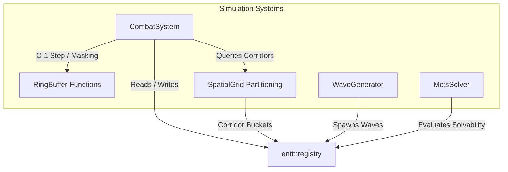

<!--
  Copyright 2026 Void Sower Authors.

  Licensed under the Apache License, Version 2.0 (the "License");
  you may not use this file except in compliance with the License.
  You may obtain a copy of the License at

      http://www.apache.org/licenses/LICENSE-2.0

  Unless required by applicable law or agreed to in writing, software
  distributed under the License is distributed on an "AS IS" BASIS,
  WITHOUT WARRANTIES OR CONDITIONS OF ANY KIND, either express or implied.
  See the License for the specific language governing permissions and
  limitations under the License.
-->

# Void Sower Developer Guide: Native C++17 ECS Engine Architecture

[◄ Developer Hub](README.md) | [01: Game Rules](01_game_rules_and_mechanics.md) | [02: ECS Engine](02_cpp_ecs_engine_architecture.md) | [03: FFI Bridge](03_dart_ffi_bridge_and_isolate_architecture.md) | [04: Presentation](04_presentation_shaders_and_audio_visual_pipeline.md) | [05: Campaign](05_campaign_economy_and_player_identity.md) | [06: Testing](06_apis_integration_and_testing_guide.md) | [07: Procedural Generation](07_procedural_generation_and_solvability_guarantees.md)

---

## 1. Architectural Overview & Design Philosophy

The simulation backend of **Void Sower** is authored in native **C++17** utilizing the header-only **EnTT Entity Component System (ECS v3.13.2)** library. The architecture prioritizes:

1. **Zero Dynamic Allocation on Hot Paths**: Active combat simulations, sowing updates, spatial hashing, and collision detections operate entirely on pre-allocated contiguous buffers or static stack arrays. Zero runtime `malloc`/`new` calls during active combat.
2. **Cache-Line Alignment (`alignas(64)`)**: Memory-critical state structures and ring buffer containers are aligned to 64-byte boundaries to eliminate false sharing and match ARM Cortex L1 cache line prefetching.
3. **Bitwise Power-of-Two Arithmetic**: The 16-bay capacitor ring uses index bitmasking (`& 0x0F`) rather than runtime integer division or modulo operators on simulation hot paths.
4. **Data-Oriented Separation**: Simulation logic is cleanly decoupled into discrete systems (`CombatSystem`, `SpatialGrid`, `WaveGenerator`, `MctsSolver`) communicating solely through `entt::registry` component views.

---

## 2. EnTT Entity Component System (ECS) Model

The game world is represented as an EnTT registry (`entt::registry`). Entities fall into three structural categories:

```
┌──────────────────────────────────────────────────────────────────────────────┐
│                           entt::registry Instance                            │
├───────────────────────┬───────────────────────────────┬──────────────────────┤
│ Dreadnought Singleton │ 16 Capacitor Bay Entities     │ Dynamic Combatants   │
├───────────────────────┼───────────────────────────────┼──────────────────────┤
│ • DreadnoughtState    │ • BatteryComponent            │ • EnemyVesselComp    │
│ • SowingStateComp     │   (Bays 0..7: Inner Reservoir)│ • ParticleLanceComp  │
│   (Transient Active)  │   (Bays 8..15: Outer Battery) │ • FlakBurstComponent │
└───────────────────────┴───────────────────────────────┴──────────────────────┘
```

---

## 3. ECS Component Schema ([`src/ecs/components.h`](file:///home/kelvingorekore/projects/void-sower/src/ecs/components.h))

All components are packed with `#pragma pack(push, 1)` to guarantee deterministic memory layouts across native C++ and Dart FFI pointers.

### 3.1 `BatteryComponent`
Configures individual capacitor bays on the dreadnought hull:
```cpp
struct BatteryComponent {
  uint8_t bay_index;          // 0 to 15
  uint8_t tier;               // 0: Inner Reservoir, 1: Outer Frontline
  uint16_t grid_column;       // Assigned screen corridor (0..7 for frontline)
  uint32_t charge_units;      // Accumulated plasma mass (M)
  float radial_position_rad;  // Hull mounting angle along dreadnought ring
  uint8_t is_frontline;       // 1 if aligned with attack corridor, 0 otherwise
  uint8_t is_nyumba;          // 1 for Bays 3 & 4 (Super-Capacitor retention)
  uint8_t is_kichwa;          // 1 for Bays 8 & 15 (Direction reversal conduit)
  uint8_t is_kimbi;           // 1 for Bays 9 & 14 (Deflection chamber)
};
```

### 3.2 `DreadnoughtStateComponent`
Tracks hull-level telemetry, inventory, and simulation state:
```cpp
struct DreadnoughtStateComponent {
  float orbital_position_x;   // Current horizontal shelf coordinate (0.0 to 1.0)
  float target_position_x;    // Smoothed target position
  uint32_t reserve_cores;     // Unplaced plasma core inventory
  float boundary_line_y;      // Critical planetary atmospheric threshold (0.2)
  uint8_t is_cascading;       // Input lock flag (1 = locked during cascade)
  uint32_t total_score;       // Cumulative session score
  uint8_t current_sim_state;  // SimulationState enum
  uint32_t cores_used;        // Total cores injected during encounter
};
```

### 3.3 `SowingStateComponent`
Transient component attached to the dreadnought entity during active distribution:
```cpp
struct SowingStateComponent {
  uint8_t origin_bay;        // Initial injection chamber
  uint8_t current_bay;       // Dynamic location of distribution head
  uint32_t remaining_units;  // Units remaining to sow
  int8_t step_direction;     // +1: Clockwise, -1: Counter-Clockwise
  float step_accumulator;    // Sub-frame interpolation timer
  uint16_t cascade_depth;    // Multi-lap relay tracking counter
  uint8_t flak_triggered;    // 1 if intermediate flak was emitted
};
```

### 3.4 `EnemyVesselComponent`
Represents an assault vessel descending toward the planet:
```cpp
struct EnemyVesselComponent {
  uint32_t entity_id;        // Unique combatant handle
  uint16_t assigned_corridor;// Corridor index (0..7)
  float world_pos_x;         // Normalized X (0.0 to 1.0)
  float world_pos_y;         // Normalized Y (descending 1.0 -> 0.0)
  float velocity_y;          // Downward movement speed
  float current_shields;     // Regenerating energy shield buffer
  float max_shields;         // Maximum barrier capacity
  float current_hull;        // Structural hull points
  float max_hull;            // Maximum structural integrity
  uint8_t vessel_type;       // VesselType: Escort (0), Cruiser (1), Flagship (2)
  uint8_t is_destroyed;      // 1 if marked for pool recycle
};
```

---

## 4. Systems Architecture



### 4.1 `CombatSystem` ([`src/ecs/systems/combat_system.cpp`](file:///home/kelvingorekore/projects/void-sower/src/ecs/systems/combat_system.cpp))
- **Step Execution (`Update(float delta_time)`)**: Steps the 60 Hz deterministic FSM, interpolates dreadnought horizontal shelf coordinates via critically damped springs, advances enemy craft, tracks particle lance and flak timers, rebuilds the spatial grid, and evaluates victory/loss conditions.
- **FSM Step Engine (`StepFSM`)**: Manages transitions between `OrbitalIdle`, `CoreInjection`, `SowingTraversal`, `EvaluateDestination`, `CrossDischarge`, `RelayOverload`, and `CleanupCheck`.
- **Damage Dispatch (`ExecuteCrossDischarge`)**: Traverses entities in the aligned corridor via `SpatialGrid`, applying quadratic particle damage ($D = \alpha \cdot M^2$) first to shields and then to hull.

### 4.2 `SpatialGrid` ([`src/ecs/systems/spatial_grid.cpp`](file:///home/kelvingorekore/projects/void-sower/src/ecs/systems/spatial_grid.cpp))
- **Corridor Partitioning**: Maps 2D continuous coordinates $(x, y)$ into 8 fixed-capacity spatial buckets corresponding to the 8 frontline corridors:
  $$\text{bucket\_idx} = \text{clamp}\left(\lfloor x \cdot 8 \rfloor, 0, 7\right)$$
- **Zero-Allocation Storage**: Each bucket contains a fixed array `uint32_t entity_ids[32]` and an occupancy counter `uint16_t count`.
- **Constant Time Rebuilding**: Clearing and rebuilding the grid takes $O(E)$ time where $E \le 64$, executing in under $4\ \mu\text{s}$ on modern ARM CPUs.

### 4.3 Ring Buffer Index Arithmetic ([`src/ecs/systems/ring_buffer.h`](file:///home/kelvingorekore/projects/void-sower/src/ecs/systems/ring_buffer.h))
- Derived from low-latency financial trading primitives in `cognitas-trading`:
  ```cpp
  inline constexpr uint8_t kRingBufferMask = kTotalBays - 1; // 0x0F

  inline uint8_t StepBayIndex(uint8_t current_index, int8_t direction) {
    return static_cast<uint8_t>((current_index + direction + kTotalBays) & kRingBufferMask);
  }

  inline uint8_t StepBayMulti(uint8_t start_index, int8_t direction, uint32_t steps) {
    int32_t offset = static_cast<int32_t>(direction) * static_cast<int32_t>(steps & kRingBufferMask);
    return static_cast<uint8_t>((start_index + offset + kTotalBays) & kRingBufferMask);
  }
  ```
- **Performance**: Bitwise masking eliminates integer division (`%`), avoiding pipeline stalls and guaranteeing deterministic single-cycle index wrapping.

---

## 5. Memory Layout & Cache Optimization

### 5.1 Structure Packing & Cache Alignment
- Critical structures (`BatteryComponent`, `DreadnoughtStateComponent`, `SpatialGridBucket`) are cache-line aligned:
  ```cpp
  alignas(64) struct DreadnoughtStateComponent { ... };
  ```
- Ensures that parallel threads (or background solver isolates) accessing disjoint dreadnought structures never invalidate neighboring L1/L2 cache lines (zero false sharing).

### 5.2 Contiguous Pooling
All combatants, beams, and flak bursts are managed within fixed-size pools:
- `kMaxEnemiesOnScreen = 64`
- `kMaxConcurrentLances = 8`
- `kMaxConcurrentFlaks = 32`
- `kMaxBucketOccupants = 32`

This bounds total peak native engine heap allocation to under **$1.8\text{ MB}$**, ensuring Void Sower executes flawlessly on low-memory Android Go devices ($1\text{ GB}$ RAM) and flagship hardware alike.

---

## 🧭 Navigation

| [◄ 01: Game Rules](01_game_rules_and_mechanics.md) | [🏠 Developer Hub](README.md) | [Next: 03 Dart FFI Bridge & Isolate Architecture ►](03_dart_ffi_bridge_and_isolate_architecture.md) |
|:---:|:---:|:---:|
