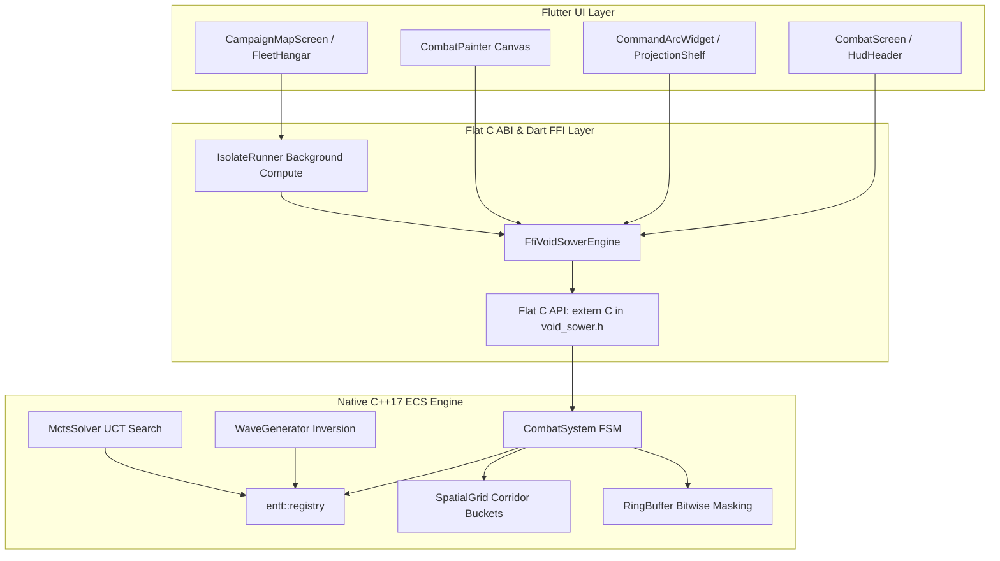

<!--
  Copyright 2026 Void Sower Authors.

  Licensed under the Apache License, Version 2.0 (the "License");
  you may not use this file except in compliance with the License.
  You may obtain a copy of the License at

      http://www.apache.org/licenses/LICENSE-2.0

  Unless required by applicable law or agreed to in writing, software
  distributed under the License is distributed on an "AS IS" BASIS,
  WITHOUT WARRANTIES OR CONDITIONS OF ANY KIND, either express or implied.
  See the License for the specific language governing permissions and
  limitations under the License.
-->

# Void Sower Developer Documentation Hub

Welcome to the **Void Sower Developer Documentation Suite**. This repository contains the complete mathematical foundations, architectural specifications, testing guides, and operational runbooks for the Void Sower Afrofuturist tactical hybrid space defense engine.

---

## 📚 Complete Technical Guides Index

| # | Guide Title | Core Subsystems & Primary Focus | Key Source Code Files |
|---|---|---|---|
| **01** | [Game Rules, Sowing Math & Quadratic Combat Mechanics](01_game_rules_and_mechanics.md) | Swahili Bao count-and-capture transposition, 16-bay ring buffer geometry, quadratic lances ($D = \alpha \cdot M^2$), secondary flak ($D_{\text{flak}} = \beta \cdot \sqrt{M'}$), special bay archetypes (Nyumba, Kichwa, Kimbi), and boundary conditions. | [`src/ecs/systems/combat_system.cpp`](../../src/ecs/systems/combat_system.cpp), [`src/ecs/components.h`](../../src/ecs/components.h) |
| **02** | [Native C++17 ECS Engine Architecture](02_cpp_ecs_engine_architecture.md) | EnTT ECS v3.13.2 registry architecture, data locality, 64-byte cache alignment (`alignas(64)`), zero dynamic allocation on hot paths, power-of-two bitwise index masking (`& 0x0F`), and spatial grid partitioning. | [`src/ecs/systems/ring_buffer.h`](../../src/ecs/systems/ring_buffer.h), [`src/ecs/systems/spatial_grid.cpp`](../../src/ecs/systems/spatial_grid.cpp) |
| **03** | [Dart FFI Bridge & Background Isolate Architecture](03_dart_ffi_bridge_and_isolate_architecture.md) | Flat C ABI (`extern "C"` in `void_sower.h`), zero-copy struct pointer caching, Android 15 16 KB memory page size alignment (`-Wl,-z,max-page-size=16384`), and background isolate offloading. | [`src/void_sower.h`](../../src/void_sower.h), [`lib/engine/ffi_void_sower_engine.dart`](../../lib/engine/ffi_void_sower_engine.dart) |
| **04** | [Presentation Shaders & Audio-Visual Pipeline](04_presentation_shaders_and_audio_visual_pipeline.md) | Impeller GLSL fragment shaders (`lance_beam.frag`, `flak_burst.frag`), `CombatPainter` 60/120 FPS canvas, Afrofuturist `VoidTheme`, procedural pitch-scaled acoustics, and multi-pulse haptic sequences. | [`lib/presentation/widgets/combat_painter.dart`](../../lib/presentation/widgets/combat_painter.dart), [`shaders/`](../../shaders/) |
| **05** | [Campaign Economy, Fleet Hangar & Player Identity](05_campaign_economy_and_player_identity.md) | Kilwa Nebula Basin 6-sector campaign map progression, star rating formulas, Orbital Fleet Hangar chassis classes (MK-I, MK-II, MK-III), local GDPR telemetry privacy, and `$0.99` Pro Upgrade monetization. | [`lib/presentation/screens/campaign_map_screen.dart`](../../lib/presentation/screens/campaign_map_screen.dart), [`lib/domain/services/`](../../lib/domain/services/) |
| **06** | [APIs, Integration & Testing Matrix](06_apis_integration_and_testing_guide.md) | Native C++ Google Test suite (ring buffer, spatial grid, combat simulation, FFI), Flutter widget tests (7 cases), Clang-format/Dart-format pre-commit tooling, and release bundle verification. | [`src/tests/`](../../src/tests/), [`test/widget_test.dart`](../../test/widget_test.dart) |
| **07** | [Procedural Wave Generation & Solvability Guarantees](07_procedural_generation_and_solvability_guarantees.md) | Backward-play program inversion algorithms, mathematical solvability proofs, Monte Carlo Tree Search (UCT) difficulty quantification, and 3-tier encounter taxonomy. | [`src/ecs/systems/wave_generator.cpp`](../../src/ecs/systems/wave_generator.cpp), [`src/ecs/systems/mcts_solver.cpp`](../../src/ecs/systems/mcts_solver.cpp) |

---

## 🗺️ High-Level System Architecture

---

## 🧭 Cross-Guide Navigation
- For core game rules, mathematical formulas, and Swahili Bao terminology, start with **[01: Game Rules & Sowing Math](01_game_rules_and_mechanics.md)**.
- To inspect the native C++17 EnTT component layout and low-latency ring buffer primitives, proceed to **[02: Native C++17 ECS Engine Architecture](02_cpp_ecs_engine_architecture.md)**.
- To explore procedural wave generation and mathematical solvability guarantees, consult **[07: Procedural Wave Generation & Solvability Guarantees](07_procedural_generation_and_solvability_guarantees.md)**.
