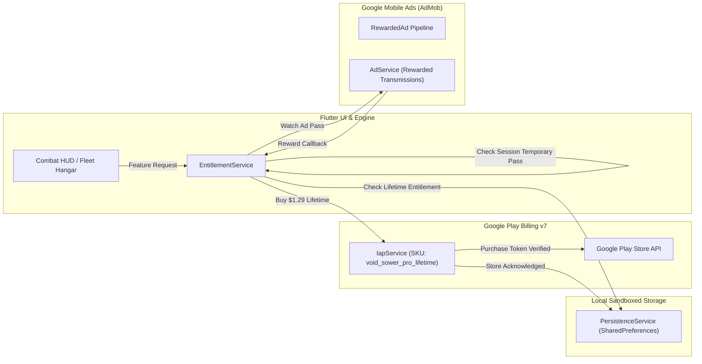

<!--
  Copyright 2026 Void Sower Authors.

  Licensed under the Apache License, Version 2.0 (the "License");
  you may not use this file except in compliance with the License.
  You may obtain a copy of the License at

      http://www.apache.org/licenses/LICENSE-2.0

  Unless required by applicable law or agreed to in writing, software
  distributed under the License is distributed on an "AS IS" BASIS,
  WITHOUT WARRANTIES OR CONDITIONS OF ANY KIND, either express or implied.
  See the License for the specific language governing permissions and
  limitations under the License.
-->

# 👑 Void Sower Tier Definition & Feature Monetization Guide

This document serves as the master reference for **Void Sower's** tier structure, comparing the **Free Tier**, the **$1.29 Pro Lifetime License** (`void_sower_pro_lifetime`), and the **Opt-In Rewarded Ad Bridge**.

---

## 1. Monetization Philosophy: Player-First & Transparent

Void Sower is built upon an ethical, player-first Afrofuturistic game design philosophy:
- **No Paywalls on the Core Campaign:** The complete 3-sector Kilwa Nebula Basin campaign, all 9 simulation state transitions, and the entire mathematical depth of Bao la Kiswahili are 100% playable for free.
- **Zero Pay-to-Win Exploits:** All campaign sectors can be beaten with tactical foresight, efficient core conservation, and cascade mastering using standard starter dreadnoughts.
- **Micro-Priced Lifetime Ownership:** Rather than aggressive predatory subscriptions or infinite gem packs, Pro is offered as a single, accessible **$1.29 USD One-Time Purchase** unlocking lifetime ad-free gameplay, premium fleet variants, deep analytical telemetry, and autonomous AI capabilities.
- **Generous Rewarded Ad Bridge:** Non-paying players can voluntarily watch short rewarded transmissions to temporarily access premium features (such as AI solver moves, flagship rentals, and emergency undos) without spending real money.

---

## 2. Feature Comparison Matrix: Free vs. Pro

| Feature Dimension | Free Tier (Standard Pilot) | Pro Tier ($1.29 Lifetime License) | Rewarded Ad Pass (Free Players) |
| :--- | :--- | :--- | :--- |
| **Price Point** | **Free Forever** ($0.00) | **$1.29 USD (One-Time Purchase)** | Free (Opt-in 30s transmission) |
| **Ads Experience** | Occasional non-intrusive interstitials between sector runs (rate-limited). | **100% Ad-Free Forever** (all interstitials & forced ads removed). | N/A |
| **Autonomous AI Tactical Solver** | Locked. | **Unlimited Autonomous Autopilot**: Native C++ multi-ply MCTS engine clears waves automatically. | **Tactical Overclock**: 1 ad grants 3 optimal AI solver moves or 30s of autopilot. |
| **Tactical Move Advisor (Smart Hints)** | Standard in-game Bao rules codex and tutorials. | **Holographic HUD Advisor**: Real-time glowing vector arrows and recommended bay markers. | **Tactical Scan**: 1 ad reveals the next 3 optimal moves in the active sector. |
| **Dreadnought Flagship Fleet** | **MK-I Bastion** (32 Cores) & **MK-II Monsoon** (36 Cores, unlocked via Star progression). | **Instant MK-III Singularity Sovereign** (40 Cores, +30% lance alpha, +30% flak area) + **Exclusive MK-IV Golden Sovereign Hull**. | **Flagship Rental**: 1 ad rents the MK-III Singularity Sovereign for 1 mission. |
| **Predictive Telemetry** | **Basic Reticle**: Direct corridor line-of-sight and frontline terminal bay indicator. | **Deep Sensor Telemetry**: Full multi-lap cascade spline paths, exact $\alpha \cdot M^2$ damage preview, and break tags. | **Deep Scan**: 1 ad enables deep cascade telemetry for the current sector run. |
| **Chrono-Anchor (Combat Rewind)** | 0 rewinds (hardcore arcade permadeath per run). | **3 Chrono-Anchors per Sector**: Undo accidental sowing slips or miscalculated discharges prior to breach. | **Emergency Rewind**: 1 ad reverses the last fatal move upon reactor depletion. |
| **Orbital Simulation Lab & Skirmish** | Standard 3-Sector Campaign (`Kilwa Nebula Basin`). | **Full Simulation Lab**: Custom wave generator, custom starting bay seeds, benchmark solver arena, and Endless Survival Skirmish. | **1 Skirmish Trial**: 1 ad grants 1 trial run in Endless Skirmish mode. |
| **Emergency Reactor Flares** | Requires watching a 30s rewarded video ad per flare (3-minute cooldown). | **Instant Emergency Flare (+8 Cores)** on demand with **0 ads** and zero cooldown. | Standard rewarded ad (+8 cores). |
| **Pilot Profile & Insignias** | Standard pilot insignias (Crest, Lance, Vanguard) and Recruit dossier badge. | **Elite Founder Insignias** (Singularity Core, Obsidian Bastion, Void Sovereign) + **Gilded Pro Commander Dossier Badge**. | N/A |
| **Telemetry & Save Data** | Local JSON save export/import with checksum verification. | Full local backup plus priority multi-device cross-import without restrictions. | N/A |

---

## 3. In-Depth Breakdown of Pro Features

### 3.1 Autonomous AI Tactical Solver & Autopilot
Driven by the native C++17 Monte Carlo Tree Search engine (`MctsSolver`), the AI Tactical Solver explores multi-ply decision trees:
- Simulates multi-lap cascade relays, mass conservation, and threat proximity.
- Evaluates optimal frontline lance alignments against descending enemy wings.
- Plays combat turns with an observable tactical cadence (350ms per move), allowing players to watch and study high-level Swahili Bao strategies.
- **Fair Play Enforcement:** Runs completed using Autopilot are recorded with an `[AI-ASSISTED]` status in the Pilot Dossier to maintain authentic competitive leaderboards.

### 3.2 Holographic Tactical Move Advisor (Smart Hints)
For players who wish to command their own vessel while receiving high-level tactical guidance:
- Projects a subtle, pulsing Afrofuturistic holographic marker over the recommended bay.
- Illustrates the optimal sowing direction with an animated glowing sweep arrow (Clockwise vs. Counter-Clockwise).
- Displays the projected damage output and cascade lap depth before the player touches the screen.

### 3.3 MK-III Singularity Sovereign & MK-IV Golden Sovereign Hull
Premium dreadnought variants accessible in the Orbital Fleet Hangar:
- **MK-III Singularity Sovereign**:
  - **Core Capacity**: 40 Reserve Cores (vs. 32 standard).
  - **Lance Alpha**: $1.30\times$ multiplier on all quadratic particle lances ($D = 1.30 \cdot 100 \cdot M^2$).
  - **Cascade Flak Radius**: $+30\%$ expanded radial damage footprint for secondary explosions.
- **MK-IV Golden Sovereign Hull (Pro Lifetime Exclusive)**:
  - Custom solar-gilded hull shader with pulsing gold circuit lattice engraving.
  - Radiant solar particle engine trails replacing standard chemical rocket exhaust.

### 3.4 Deep Sensor Telemetry
Upgrades the middle-tier Dynamic Projection Shelf:
- Visualizes the full multi-hop traversal trajectory as a glowing particle spline looping across the 16 capacitor bays.
- Displays projected damage values, remaining enemy hull/shield percentages after impact, and visual indicators for deflecting falling bombs.

### 3.5 Chrono-Anchor (Tactical Combat Rewind)
An in-combat time-dilation safety net:
- The combat coordinator maintains a deterministic circular snapshot ring buffer of the previous 3 turns (bay charge distributions, dreadnought core pool, and descending enemy positions).
- If a player makes an accidental swipe or miscalculates a sowing relay, tapping the Chrono-Anchor rolls back time to the state immediately preceding the move.
- Pro commanders receive **3 Chrono-Anchors per sector**.

### 3.6 Orbital Simulation Lab & Endless Skirmish Arena
A dedicated sandbox environment for theorycrafting and infinite survival:
- **Custom Wave Generator**: Adjust invader vessel density, descent velocity, shield resilience, and corridor distributions.
- **Custom Bay Allocator**: Seed arbitrary energy distributions across the 16 capacitor bays to stress-test complex 5+ lap cascade relays.
- **Autonomous Solver Benchmark**: Watch the C++ MCTS solver solve custom puzzle boards.
- **Endless Skirmish**: Battle unending escalating waves of alien swarms with global high score tracking.

### 3.7 100% Ad-Free Experience & Instant Emergency Flares
- Completely eliminates all banner advertisements and post-sector interstitial transitions.
- During moments of critical reactor depletion, Pro commanders can tap the emergency core gauge to instantly inject $+8\text{ Plasma Cores}$ without watching a video ad or waiting out a 3-minute cooldown.

---

## 4. Rewarded Ad Bridge: Fair Access for Everyone

Free players are never locked out of experiencing Pro capabilities. Void Sower provides opt-in, non-intrusive **Rewarded Transmissions**:
1. **Zero Forced Commercials**: Players are never interrupted by surprise popups during active combat simulations.
2. **Contextual In-Game Offers**: When attempting to engage an advanced feature (such as toggling the AI solver or equipping the MK-III Singularity), a glassmorphic prompt offers:
   - "Unlock Pro Commander ($1.29 Lifetime)" OR
   - "Watch 1 Transmission for a Temporary Mission Pass".
3. **Transparent Cooldowns**: Standard rewarded flares feature smart cooldowns (minimum 3 minutes) to maintain game balance and prevent spamming.

---

## 5. Technical Entitlement & Store Architecture

- **SKU**: `void_sower_pro_lifetime` ($1.29 USD, Non-Consumable).
- **Billing API**: Google Play Billing Library v7 via Flutter `in_app_purchase: ^3.3.0`.
- **Mandatory Purchase Acknowledgment**: Implemented in `IapService` using `completePurchase()` to prevent automatic 3-day refund rollbacks.
- **Instant Local Verification & Restore**: The "Restore Purchases" button in Settings cross-checks active Play Store receipts and synchronizes local device state.
- **Offline Resilience**: Once purchased, Pro status is securely cached locally, enabling full offline play without requiring an active internet connection.

---

## 6. Frequently Asked Questions (FAQ)

### Q: Is Void Sower pay-to-win?
**No.** All sectors in the Kilwa Nebula campaign can be completed with a 3-star rating using the free MK-I Bastion flagship. Pro features provide convenience, advanced analytical overlays, sandbox tools, and cosmetics.

### Q: What happens if I switch devices or reinstall the app?
Your $1.29 Pro Lifetime purchase is permanently tied to your Google Play Account. Simply open **Settings > Fleet System Config > Restore Purchases** on your new device to restore your Pro Commander status.

### Q: Can I use the AI Tactical Solver without paying?
**Yes.** Free players can watch an opt-in rewarded video transmission to receive a **Tactical Overclock** pass granting 3 optimal moves or 30 seconds of autonomous guidance.

### Q: Does Pro work offline?
**Yes.** Once your Pro purchase has been validated with Google Play, the entitlement is persisted in secure on-device storage. You can play 100% offline without ads.

### Q: What are the differences between MK-I, MK-II, and MK-III flagships?
- **MK-I Bastion**: Standard balanced 16-bay dreadnought (32 cores, $1.00\times$ lance damage). Unlocked by default.
- **MK-II Monsoon**: Specialized Nyumba conduits (36 cores, $1.15\times$ lance damage). Earned for free by collecting 15 campaign stars.
- **MK-III Singularity Sovereign**: Heavy graviton flagship (40 cores, $1.30\times$ lance damage, $+30\%$ flak burst radius). Unlocked with Pro or rentable per mission with a rewarded ad pass.
