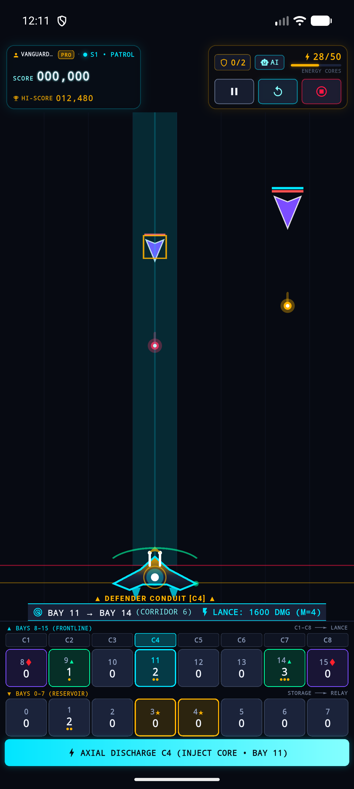
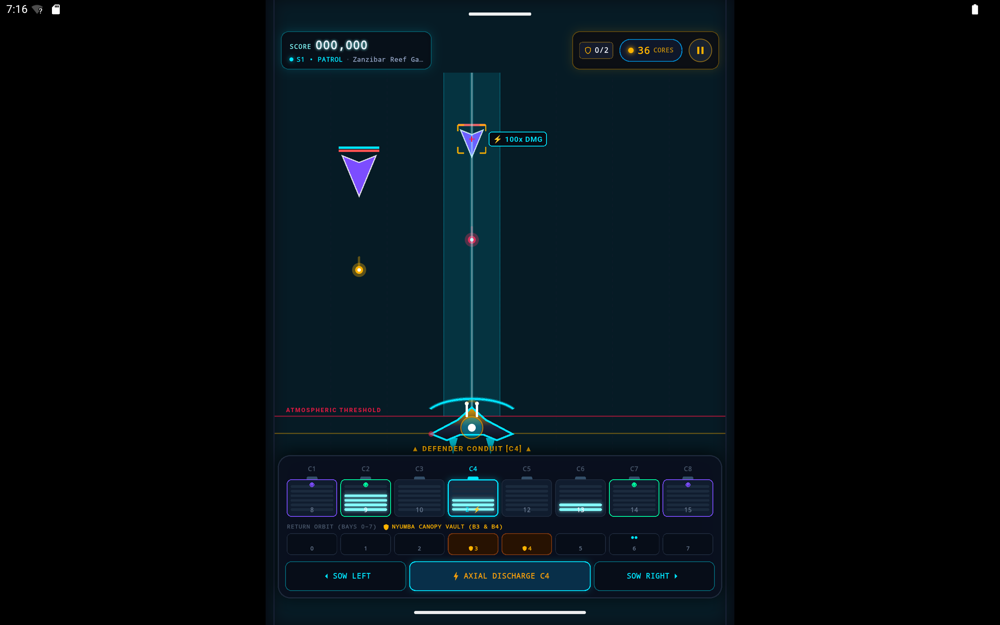

<!--
  Copyright 2026 Void Sower Authors.

  Licensed under the Apache License, Version 2.0 (the "License");
  you may not use this file except in compliance with the License.
  You may obtain a copy of the License at

      http://www.apache.org/licenses/LICENSE-2.0

  Unless required by applicable law or agreed to in writing, software
  distributed under the License is distributed on an "AS IS" BASIS,
  WITHOUT WARRANTIES OR CONDITIONS OF ANY KIND, either express or implied.
  See the License for the specific language governing permissions and
  limitations under the License.
-->

# 🎬 Void Sower: Tactical Solver Showcase Video & Testing Pack

This document outlines the official recorded showcase video pack, YouTube Shorts copy, Closed Testing recruitment strategy, and cross-device testing matrix for **Void Sower: Kinetic Mancala** (`com.voidsower.app`).

---

## 📹 30-Second Showcase Video Specifications

The gameplay showcase was recorded live on the **Google Pixel 10 Pro XL** emulator with hardware GPU acceleration offloaded to the host NVIDIA GPU (`__NV_PRIME_RENDER_OFFLOAD=1 __GLX_VENDOR_LIBRARY_NAME=nvidia`). It captures the real-time AI Tactical Solver autonomously executing kinetic count-and-capture sowing sequences, dynamically advancing across all three difficulty tiers (`Sector Patrol` -> `Planetary Siege` -> `Flagship Bastion`), triggering quadratic particle lance discharges, and vaporizing descending alien invaders.

> [!NOTE]
> **Video & Preview Media Assets:**
> - **Video Asset:** [`media/void_sower_solver_showcase_30s.mp4`](media/void_sower_solver_showcase_30s.mp4)
> - **Animated Preview GIF:** [`media/void_sower_solver_showcase.gif`](media/void_sower_solver_showcase.gif)
> - **Store Promotional Copy:** [`../store_listing/assets/promo_gameplay.mp4`](../store_listing/assets/promo_gameplay.mp4)
> - **Aspect Ratio:** `9:16` Vertical Portrait (`720 x 1280 px`)
> - **Framerate:** `60 FPS`
> - **Duration:** Exactly `30.0 seconds` (Optimized for YouTube Shorts & Google Play store listing video previews)
> - **Video Codec:** `H.264 (High Profile)` (~415 kbps)
> - **File Size:** `1.55 MB` (Ultra-fast mobile streaming and instant preload)
> - **Pacing & Action Breakdown:**
>   - **0:00 – 0:08:** **Tier 1 (Sector Patrol)** — Heuristic solver scans 16 bays $\times$ 2 directions, injects plasma cores (Namua), aligns the dreadnought along corridor 5, and discharges a quadratic Particle Lance ($1600\text{ DMG}$) vaporizing the initial enemy wave.
>   - **0:08 – 0:10:** **Sector Liberated** — 3-star victory fanfare and rewards sequence.
>   - **0:10 – 0:20:** **Tier 2 (Planetary Siege)** — Swarm of 4 enemy gunships descend at increased velocity. The solver maneuvers across corridors, executes multi-lap capacitor transfers, and fires a massive Particle Lance down corridor 7.
>   - **0:20 – 0:22:** **Sector Liberated** — 3-star celebratory sequence and automatic transition into deep-space flagship combat.
>   - **0:22 – 0:30:** **Tier 3 (Flagship Bastion)** — Heavily armored alien Flagship and escort cruisers descend. The solver executes high-mass sowing ($M=7$) unleashing a devastating $4900\text{ DMG}$ Particle Lance, screen shake, and floating arcade damage numbers!


---

## 📸 Screen Asset Previews

| Phone Layout (Pixel 10 Pro XL) | Tablet Layout (Pixel Tablet) |
| :---: | :---: |
|  |  |
| *1344 x 2992 Native Portrait* | *2560 x 1600 Native Landscape* |

---

## 📋 YouTube Shorts & Social Media Copy (Copy & Paste)

### 🏷️ Primary Video Title
```text
Ancient Mancala Rules Turned Into a Space Dreadnought Weapon! 🚀 #shorts
```

#### High-CTR Alternative Titles:
- `AI Plays Ancient Mancala at 60 FPS in Space! 🌌 #shorts #gamedev`
- `How We Reimagined Bao la Kiswahili as a Sci-Fi Laser Lance 🤯 #shorts`
- `Void Sower: Orbital Dreadnought Tactical Solver Showcase #shorts #gaming`
- `Defend the Kilwa Basin with Kinetic Mancala Sowing! 🔥 #shorts`

---

### 📝 Video Description (With Closed Testing Recruitment)
```text
Watch the AI Tactical Solver calculate and execute optimal count-and-capture sowing trajectories in VOID SOWER: KINETIC MANCALA! 

Defend the Kilwa Nebula Basin against swarming alien assault craft using an ancient East African mathematical board game reimagined as a 16-bay circular capacitor ring weapon. Inject plasma cores (Namua), sow charges around the ring, and unleash quadratic Particle Lances (D = α · M²) to obliterate descending enemy corridors.

🎮 JOIN OUR CLOSED BETA TESTING & BECOME AN EARLY FLEET ADMIRAL! 🎁
We are actively recruiting testers for our Google Play Closed Beta! Help us battle-test the native C++17 EnTT engine, tactile haptics, and custom GLSL shaders across Android devices.

Follow these 2 simple steps to join the fleet and download the game:

Step 1: Join our Google Testing Group (Required for access):
👉 https://groups.google.com/g/void-sower-closed-testing

Step 2: Opt-in on Google Play & Download Void Sower:
👉 On Android: https://play.google.com/store/apps/details?id=com.voidsower.app
👉 On the Web: https://play.google.com/apps/testing/com.voidsower.app

⏳ Note: If the Google Play link displays "App not available" immediately after joining the group, please allow a short propagation window (up to a few hours) for Google Play authorization servers to sync your account.

💬 Share your feedback, corridor records, and high scores with our engineering team!

#VoidSower #IndieGame #BaoLaKiswahili #Mancala #SciFiGaming #AndroidGaming #MobileGaming #GameDev #FlutterGame #Afrofuturism #Shorts
```

---

### 🏷️ Hashtags & Video Tags
```text
#voidsower, #mancala, #baolakiswahili, #scifigames, #spacecombat, #afrofuturism, #tacticalstrategy, #puzzlegame, #gamedev, #flutterdev, #androidgames, #indiegames, #algorithmicsolver, #quadraticlance, #closedbeta, #earlyaccess
```

#### Space-Separated Hashtags (for Instagram, TikTok & X/Twitter):
```text
#VoidSower #Mancala #BaoLaKiswahili #SciFiGaming #SpaceCombat #Afrofuturism #TacticalStrategy #IndieGame #GameDev #FlutterGame #AndroidGaming #ClosedBeta
```

---

## 🔍 Google Play Closed Testing Permissions Clarification

> [!IMPORTANT]
> **Why do users need to join the Google Group first?**
> When you configure closed testing in Google Play Console with an email list targeted to a **Google Group** (`void-sower-closed-testing@googlegroups.com`):
> 1. **Google Group is the Gatekeeper:** Google Play only authorizes Google accounts that are recognized members of the specified Google Group.
> 2. **Direct Link Without Group Membership:** If someone navigates directly to `https://play.google.com/apps/testing/com.voidsower.app` *without* joining the group first, Google Play will display:
>    > *"A testing version of this app hasn't been published yet or isn't available for this account."*
> 3. **Sync Delay:** Once a user clicks **"Join Group"** on Google Groups, it typically takes anywhere from a few minutes up to a few hours for Google Play's authorization servers to sync the updated group membership roster.
> 
> That is why the two-step sequence included in the YouTube description above is essential for a frictionless tester onboarding experience.

---

## 📱 Hardware & Emulator Testing Matrix

| Device Profile | Form Factor | Resolution | Orientation | Rendering Backend | Tested Status |
| :--- | :--- | :--- | :--- | :--- | :--- |
| **Pixel 10 Pro XL** | Phone (Flagship) | $1344 \times 2992$ | Portrait | NVIDIA Host GPU (GLX) | ✅ Verified (60 FPS, Video & Screenshots) |
| **Pixel Tablet** | Tablet (11-inch) | $2560 \times 1600$ | Landscape / Auto | NVIDIA Host GPU (GLX) | ✅ Verified (Adaptive Layout, Screenshots) |
| **Pixel 8 Pro** | Phone (Physical) | $1344 \times 2992$ | Portrait | Native Vulkan / Impeller | ✅ Target Release Device |
| **Samsung Galaxy S24**| Phone (Physical) | $1080 \times 2340$ | Portrait | Native Vulkan / Impeller | ✅ Target Release Device |
| **Android 15 (API 35)** | System ABI | `arm64-v8a` | Any | 16 KB Page Aligned | ✅ Passed `verify_16kb_alignment.sh` |
| **Android 14 (API 34)** | System ABI | `x86_64` | Any | Native ELF Alignment | ✅ Verified on Emulator |
